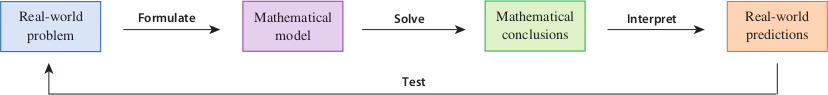
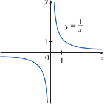
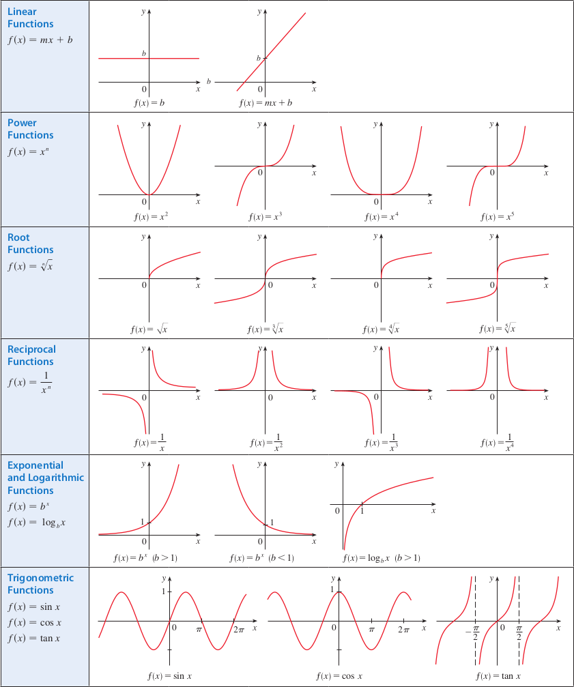

# 1.2: Mathematical Models: A Catalog of Essential Functions
- A **mathematical model** is a mathematical description (often function or equation) of a real-world phenomenon, such as population size, speed of falling object, etc. These models serve to understand the phenomenon and maybe make future predictions
- Our first task in the modeling process is to identify our independent and dependent variables. Also, often need to make simplifying assumptions to make the model feasible. We may need to collect data to discern patterns
- Second, we apply mathematics we know to the model to derive mathematical conclusions
- Third, we take our conclusions and interpret them to offer explanations or make predictions
- Finally, we test our predictions against new real data
- 
- Mathematical models are never completely accurate, but can be accurate enough to provide valuable conclusions

## Linear Models
- To say that $y$ is a **linear function** of $x$ means that the graph of the function is a line, so we can use slope-intercept form
  - Formula: $y = f(x) = mx + b$
    - $m$ is the slope
    - $b$ is the $y$-intercept
- Characteristic of linear functions is that they change at a constant rate. The slope of the graph can be interpreted as the rate of change of $y$ with respect to $x$
- If there is no physical law/principle to help us formulate a model, we construct an **empirical model**, which is based on collected data. We try to find a curve that fits the data, capturing basic trends

## Polynomials
- A function $P$ is called a **polynomial** if 
  - $P(x) = a_nx^n + a_{n-1}x^{n-1} + ... + a_2x^2 + a_1x + a_0$
  - where $n$ is a nonnegative integer and $a_0, a_1, a_2, ..., a_n$ are constants called **coefficients**
- The domain of any polynomial is $\mathbb{R} = (-\infty, \infty)$
- If the **leading coefficient** of the polynomial is not 0, then the **degree** of the polynomial is $n$
- Example: $P(x) = 2x^6 - x^4 + \frac{2}{5}x^3 + \sqrt{2}$ is a polynomial with a degree of 6
- A polynomial of degree one is a linear function and has the form $P(x) = mx + b$
- A polynomial of degree two is a **quadratic function** and has the form $P(x) = ax^2 + bx + c$
  - This graph is always a parabola obtained by shifting the parabola $y = ax^2$
  - Opens upward if $a \gt 0$ and downward if $a \lt 0$
- A polynomial of degree 3 is called a **cubic function** and has the form $P(x) = ax^3 + bx^2 + cx + d; a \ne 0$

## Power Functions
- A function in the form $f(x) = x^a$, where $a$ is a constant, is called a **power function**
- Several cases
  - $a = n; n \gt 0$ and $n$ is an integer
    - If $n$ is even, then the power function is an even function and its graph is similar to a parabola
    - If $n$ is odd, then the power function is an odd function and its graph is similar to $y = x^3$
    - Each of these are considered a **family of functions**
  - $a = \frac{1}{n}$ and $n$ is a positive integer
    - These are root functions, $f(x) = x^{\frac{1}{n}} = \sqrt[n]{x}$
  - $a = -1$
    - This is a **reciprocal function**, the graph is a hyperbola
    - 
  - $a = -2$, by far the most important of the remaining negative powers
    - Many natural laws state that one quantity is inversely proportional to the square of another quantity
    - Inverse square laws model gravitational force, loudness of sound, and electrostatic force between two charged particles

## Rational Functions
- A **rational function** $f$ is a ratio of two polynomials
  - $f(x) = \frac{P(x)}{Q(x)}$ where $P$ and $Q$ are polynomials
  - The domain is all values of $x$ such that $Q(x) \ne 0$

## Algebraic Functions
- A function $f$ is an **algebraic function** if it can be constructed using algebraic operations (addition, subtraction, multiplication, division, taking roots)
- Any rational function is automatically an algebraic function
- Functions that are not algebraic are called **transcendental**, these include trigonometric, exponential, and logarithmic functions

## Trigonometric Functions
- In calculus, the convention is to always use the *radian measure*
  - Example is $f(x) = \sin{x}$; $\sin{x}$ means the sine of an angle whose radian measure is $x$
- An important property of sine and cosine functions is that they are periodic functions and have a period of $2\pi$
- The tangent function, $\tan{x} = \frac{\sin{x}}{\cos{x}}$ has a period of $\pi$ and a range of $(-\infty, \infty)$

## Exponential Functions
- An **exponential function**, $f(x) = b^x$ (where $b$ is a positive constant), are useful for modeling many natural phenomena

## Logarithmic Functions
- **Logarithmic functions**, $f(x) = \log_b{x}$ (where the base $b$ is a positive constant), are the inverse functions of exponential functions

