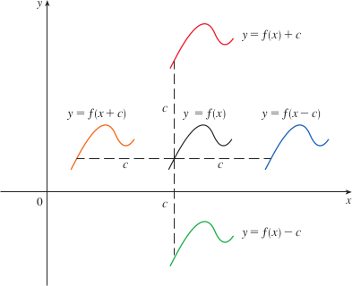
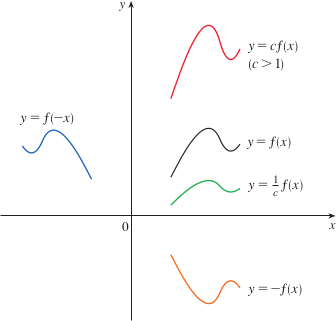
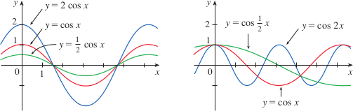

# 1.3: New Functions from Old Functions

## Transformations of Functions
- By applying transformations to the graph of a given function, we can obtain graphs of related functions
- **Translations** of graphs
  - If $c$ is a positive number, $y = f(x) + c$ is just $y = f(x)$ shifted up by c units
  - Similarly, if $g(x) = f(x - c)$, where $c \gt 0$, the value of $g$ at $x$ is the same as the value of $f$ at $x - c$. So the graph of $y = f(x - c)$ is just the graph of $y = f(x)$ shifted $c$ units to the right
  - 
  - Vertical and Horizontal shifts
    - Assuming $c \gt 0$
    - $y = f(x) + c$, shift the graph of $y = f(x)$ a distance $c$ units upward
    - $y = f(x) - c$, shift the graph of $y = f(x)$ a distance $c$ units downward
    - $y = f(x - c)$, shift the graph of $y = f(x)$ a distance $c$ units to the right
    - $y = f(x + c)$, shift the graph of $y = f(x)$ a distance $c$ units to the left
- **Stretching** and **Reflecting** graphs
  - If $c \gt 1$, then $y = cf(x)$ is the graph of $y = f(x)$ stretched by a factor of $c$ in the vertical direction
  - The graph of $y = -f(x)$ is the graph of $y = f(x)$ reflected about the x-axis
  - 
  - Suppose $c > 1$. To obtain the graph of:
  - $y = c f(x)$, stretch the graph of $y = f(x)$ vertically by a factor of $c$
  - $y = \left(\frac{1}{c}\right) f(x)$, shrink the graph of $y = f(x)$ vertically by a factor of $c$
  - $y = f(cx)$, shrink the graph of $y = f(x)$ horizontally by a factor of $c$
  - $y = f\left(\frac{x}{c}\right)$, stretch the graph of $y = f(x)$ horizontally by a factor of $c$
  - $y = -f(x)$, reflect the graph of $y = f(x)$ about the $x$-axis
  - $y = f(-x)$, reflect the graph of $y = f(x)$ about the $y$-axis
  - 
- Absolute value transformations
  - For the graph of $y = |f(x)|$, we can derive from $y = f(x)$
    - The part of the graph that lies above the x-axis remains the same, and the part that lies below the x-axis is reflected about the x-axis

## Combinations of Functions
- Two functions $f$ and $g$ can be combined to form new functions like $f+g$, $f-g$, $fg$, and $f/g$ similar to how real numbers are added, subtracted, multiplied and divided
- Given two functions $f$ and $g$, the **sum**, **difference**, **product**, and **quotient** functions are defined by
  - $(f + g)(x) = f(x) + g(x)$
  - $(f - g)(x) = f(x) - g(x)$
  - $(fg)(x) = f(x)g(x)$
  - $(\frac{f}{g})(x) = \frac{f(x)}{g(x)}$
- If the domain of $f$ is $A$ and the domain of $g$ is $B$, then the domain of $f + g$ (and $f - g$) is $A \cap B$
- Composition of functions is another way to combine functions, ex. $f(g(x))$, where the output of one function, $g(x)$ is used as the input of the second function $f$ (provided it is in the domain of $f$)
  - $(f \circ g)(x) = f(g(x))$
  - Remember that that $(f \circ g)(x) \ne (g \circ f)(x)$ unless the functions are the same
  - This composition idea can be extended to more than two functions
  - Often in calculus, we will want to decompose complicated functions into simpler ones