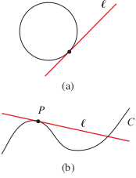
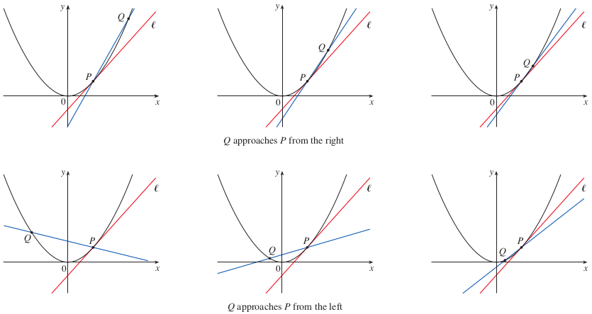
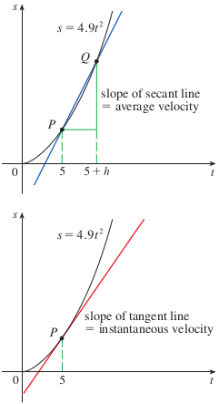

# 1.4: The Tangent and Velocity Problems

## The Tangent Problem
- A tangent to a curve is a line that touches the curve and follows the same direction of the curve at the point of contact
  - A possible definition (for a circle) is a line that intersects a circle once and only once
  - However, this definition does not work for more complicated curves
- 
- Example: Find a tangent line to the parabola $y = x^2$ at the point $P(1, 1)$
  - To find the tangent line, we need to know its slope $m$, but we only know one point
  - We can find an approximate slope using a nearby point though, $Q(x, x^2)
  - This gives us the slope $m_{PQ}$ of the secant line $PQ$
    - A **secant line** is a line that intersects a curve more than once
  - As we choose points closer and closer to $P(1, 1)$, we see that the slope is converging on a single number (in this instance, 2)
  - The slope of the tangent line is the *limit* of the slopes of the secant lines, which is written as $\lim_{Q \to P}m_{PQ} = m$
  - For this specific problem, it would be written as $$\lim_{x \to 1}\frac{x^2 - 1}{x - 1} = 2$$
  - If the slope of the tangent line is indeed 2, we can write the equation of a tangent line through $(1, 1)$ as $y = 2x - 1$
- You can approach a limit from the left or the right, examples are shown below
- 

## The Velocity Problem
- The *velocity problem* is finding the instantaneous velocity of an object moving along a straight path at a specific time if the position of the object at any time is known
- There is a very close connection between the tangent problem and the velocity problem
  - One previous approach to this (which ignores air resistance) is Galileo's formula that the distance fallen by any freely falling body is proportional to the square of the time it has been falling
  - This formula is expressed as $s(t) = 4.9t^2$
- Example: Find the velocity of a dropped ball after 5 seconds
  - We can approximate the desired quantity by computing average velocity over smaller and smaller time intervals
    - $\text{average velocity} = \frac{\text{change in position}}{\text{time elapsed}}$
    - $= \frac{s(5.1) - s(5)}{0.1}$
    - $= \frac{4.9(5.1)^2 - 4.9(5)^2}{0.1} = 49.49\text{ m/s}$
  - As we calculate smaller and smaller intervals, the average velocity looks to converge upon 49 m/s
- The velocity at time $t = 5$ must be equal to the slope of the tangent line at $P$ (the limit of the slope of the secant lines)
- 
- Both the tangent and velocity problems rely on finding limits