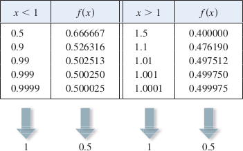
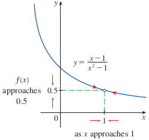
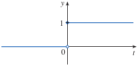

# 1.5: The Limit of a Function

## Finding Limits Numerically and Graphically
- Investigate the behavior of the function $f(x) = \frac{x - 1}{x^2 - 1}$ for values of $x$ near 1
- 
- As $x$ approaches 1, the closer the results of $f(x)$ are to 0.5
- This can be expressed as "The limit of the function $f(x) = (x - 1)/(x^2 - 1)$ as $x$ approaches 1 is equal to 0.5" and can be written as $$\lim_{x \to 1}\frac{x - 1}{x^2 - 1} = 0.5$$
- 
- **Intuitive Definition of a Limit**
  - Suppose $f(x)$ is defined when $x$ is near the number $a$. Then we write $$\lim_{x \to a}f(x) = L$$ and say "the limit of $f(x)$, as $x$ approaches $a$, equals $L$" if we can make the values of $f(x)$ arbitrarily close to $L$ (as close to $L$ as we like) by restricting $x$ to be sufficiently close to $a$ (on either side of $a$) but not equal to $a$
- In other words, the values of $f(x)$ approach $L$ as $x$ approaches $a$ (from either side), but $x \ne a$
- This could also be shown as $f(x) \to L\text{ as } x \to a$
- The phrase "but $x$ not equal to $a$" is the definition of the limit
  - $f(x)$ does not have to be defined at $a$, bu rather it is about how $f$ is defined *near* $a$

## One-Sided Limits
- The Heaviside function $H$ is defined as 
$$
H(t) = 
\begin{cases}
0 & \text{if } t < 0 \\
1 & \text{if } t \geq 0
\end{cases}
$$
- 
- There is no single number that $H(t)$ approaches as $t$ approaches 0, so $\lim_{t \to 0}H(t)$ does not exist (two sided limit)
- Because there are different limits approaching from the left and from the right, we need new notation
  - As $t$ approaches 0 from the left, $H(t)$ approaches 0 $$\lim_{t \to 0^-}H(t) = 0$$
  - As $t$ approaches 0 from the right, $H(t)$ approaches 1 $$\lim_{t \to 0^+}H(t) = 1$$
  - These are called *one-sided limits*
  - The notation $t \to 0^-$ means we only consider values of $t$ less than 0
    - This can also be referred to as a "left-hand limit"
  - The notation $t \to 0^+$ means we only consider values of $t$ greater than 0
    - This can also be referred to as a "right-hand limit"

## How Can a Limit Fail to Exist?
- A limit fails to exist at a number $a$ if the left- and right-hand limits are not equal
- There are additional ways that a limit can fail to exist, such as a function $f(x) = \sin(\frac{\pi}{x})$, which oscillates infinitely as $x$ approaches 0.
  - This means it is not approaching a fixed number, so $\lim_{x \to 0}\sin\frac{\pi}{x}$ does not exist
- Another way a limit can fail to exist is when function values grow arbitrarily large as $x$ approaches $a$
  - For example, the limit $\lim_{x \to 0}\frac{1}{x^2}$ does not exist

## Infinite Limits; Vertical Asymptotes
- Using the previous example without a limit, we use the notation $$\lim_{x \to 0}\frac{1}{x^2} = \infty$$
- This does not mean $\infty$ is a number, or that a limit exists, it expresses the way in which the limit does not exist
- This means that values of $f(x)$ tend to become larger and larger (without bound) as $x$ becomes closer and closer to $a$ (but not equal to $a$)
- This can also be written as $f(x) \to \infty\text{ as }x \to a$
  - "the limit of $f(x)$, as $x$ approaches $a$, is infinity"
- These infinite limits can grow in the positive or negative direction, the "infinite" is referring to its magnitude (absolute value)
- The vertical line $x = a$ is a **vertical asymptote** of the curve $y = f(x)$ if at least on the following statements is true
  - $\lim_{x \to a}f(x) = \infty$
  - $\lim_{x \to a}f(x) = -\infty$
  - $\lim_{x \to a^-}f(x) = \infty$
  - $\lim_{x \to a^-}f(x) = -\infty$
  - $\lim_{x \to a^+}f(x) = \infty$
  - $\lim_{x \to a^+}f(x) = -\infty$
