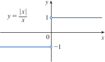

# 1.6: Calculating Limits Using the Limit Laws

## Properties of Limits
- **Limit Laws** can be used to calculate limits precisely
- Suppose that $c$ is a constant and the limits $$\lim_{x \to a}f(x)$$ and $$\lim_{x \to a}g(x)$$ exist. Then 
  1. $\lim_{x \to a} [f(x) + g(x)] = \lim_{x \to a} f(x) + \lim_{x \to a} g(x)$  
  2. $\lim_{x \to a} [f(x) - g(x)] = \lim_{x \to a} f(x) - \lim_{x \to a} g(x)$  
  3. $\lim_{x \to a} [cf(x)] = c \lim_{x \to a} f(x)$  
  4. $\lim_{x \to a} [f(x)g(x)] = \lim_{x \to a} f(x) \cdot \lim_{x \to a} g(x)$  
  5. $\lim_{x \to a} \frac{f(x)}{g(x)} = \frac{\lim_{x \to a} f(x)}{\lim_{x \to a} g(x)} \quad \text{if } \lim_{x \to a} g(x) \ne 0$
- These five laws can be stated verbally
  - **Sum Law**: The limit of a sum is the sum of the limits
  - **Difference Law**: The limit of a difference is the difference of the limits
  - **Constant Multiple Law**: The limit of a constant times a function is the constant times the limit of the function
  - **Product Law**: The limit of a product is the product of the limits
  - **Quotient Law**: The limit of a quotient is the quotient of the limits (provided that the limit of the denominator is not 0)
- Additionally, there are other limit laws
  - **Power Law**: $\lim_{x \to a}[f(x)]^n = [\lim_{x \to a}f(x)]^n$ where $n$ is a positive integer
  - **Root Law**: $\lim_{x \to a}\sqrt[n]{f(x)} = \sqrt[n]{\lim_{x \to a}f(x)}$ where $n$ is a positive integer
    - If $n$ is even, we assume that $\lim_{x \to a}f(x) \gt 0$
- There are two special limits that are needed in applying these seven limit laws
  - $\lim_{x \to a}c = c$
  - $\lim_{x \to a}x = a$
- There is a special limit for power functions
  - $\lim_{x \to a}x^n = a^n$
- There is a special limit for roots
  - $\lim_{x \to a}\sqrt[n]{x} = \sqrt[n]{a}$ (if $n$ is even, we assume that $a \gt 0$)

## Evaluating Limits by Direct Substitution
- **Direct Substitution Property**: If $f$ is a polynomial or a rational function and $a$ is in the domain of $f$, then $$\lim_{x \to a}f(x) = f(a)$$
- Functions with this direct substitution property are called *continuous at a*, but not all limits can be evaluated through direct substitution
- Example: $\lim_{x \to 1}\frac{x^2 - 1}{x - 1}$
  - We can't find the limit by substituting 1 because the denominator cannot be 0, so we factor the numerator as a difference of squares
  - $\frac{x^2 - 1}{x - 1} = \frac{(x - 1)(x + 1)}{x - 1}$
  - We can cancel the common factor and then use substitution
  - $\lim_{x \to 1}(x + 1) = 1 + 1 = 2$
- Example: $\lim_{h \to 0}\frac{3 + h)^2 - 9}{h}$
  - Cannot directly substitute, because denominator cannot be 0
  - Simplify algebraically
    - $F(h) = \frac{(9 + 6h + h^2) - 9}{h} = \frac{6h + h^2}{h}$
    - $= \frac{h(6 + h)}{h} = 6 + h$
    - $\lim_{h \to 0}(6 + h) = 6$

## Using One-Sided Limits
- Some limits are best calculated by finding the left- and right-hand limits
  - Remember that a two-sided limit exists if and only if both of the one-sided limits exist and are equal
  - Theorem: $$\lim_{x \to a}f(x) = L$$ if and only if $$\lim_{x \to a^-}f(x) = L = \lim_{x \to a^+}f(x)$$
- Remember that the limit laws also hold for one-sided limits
- If the right-hand and left-hand limits are different, then there is no two-sided limit
- Example: $\lim_{x \to 0}\frac{|x|}{x}$
  - $\lim_{x \to 0+}\frac{|x|}{x} = \lim_{x \to 0^+}\frac{x}{x} = \lim_{x \to 0^+}1 = 1$
  - $\lim_{x \to 0-}\frac{|x|}{x} = \lim_{x \to 0^-}\frac{-x}{x} = \lim_{x \to 0^-}(-1) = -1$
  - 
- **Greatest Integer Function** is defined by $[[x]] = $ the largest integer that is less than or equal to $x$
  - For example, $[[4]] = 4; [[4.8]] = 4, [[\pi]] = 3, [[-\frac{1}{2}]] = -1$, etc.
  - This function has a series of one-sided limits that are not equal, so $\lim_{x \to 3}[[x]]$ does not exist
  - 

## The Squeeze Theorem
- The following theorems describe how the limits of functions are related when the values of one function are greater than (or equal to) those of another
  - **Theorem**: If $f(x) \leq g(x)$ when $x$ is near $a$ (except possibly at $a$) and the limits of $f$ and $g$ both exist as $x$ approaches $a$, then $$\lim_{x \to a}f(x) \leq \lim_{x \to a}g(x)$$
  - **The Squeeze Theorem**: If $f(x) \leq g(x) \leq h(x)$ when $x$ is near $a$ (except possibly at $a$) and $$\lim_{x \to a}f(x) = \lim_{x \to a}h(x) = L$$ then $$\lim_{x \to a}g(x) = L$$
    - The squeeze theorem says that if $g(x)$ is squeezed between $f(x)$ and $h(x)$ near $a$, and if $f$ and $h$ have the same limit $L$ at $a$, then $g$ is forced to have the same limit $L$ at $a$
    - 
