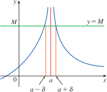

# 1.7: The Precise Definition of a Limit
- "Intuitive" definitions of limits are inadequate sometimes, because they are vague
  - For example, "$x$ is close to 2" and "$f(x)$ gets closer and closer to $L$"

## The Precise Definition of a Limit
- Let $f$ be a function defined on some open interval that contains the number $a$, except possibly $a$ itself.
- Then we say that the **limit of $f(x)$ as $x$ approaches $a$ is $L$, which is written $$\lim_{x \to a}f(x) = L$$ if for every number $\epsilon \gt 0$ there is a number $\delta \gt 0$ such that $$\text{if }0 \lt |x - a| \lt \delta\text{ then }|f(x) - L| \lt \epsilon$$
- You can express this as $\lim_{x \to a}f(x) = L$ means that the distance between $f(x)$ and $L$ can be made arbitrarily small by requiring that the distance from $x\text{ to }a$ be sufficiently small (but not 0).

## One-Sided Limits
- Precise definition of left-hand limit
  - $\lim_{x \to a^-}f(x) = L$ if for every number $\epsilon \gt 0$ there is a number $\delta \gt 0$ such that if $a - \delta \lt x \lt a$ then $|f(x) - L| \lt \epsilon$
- Precise definition of right-hand limit
  - $\lim_{x \to a^+}f(x) = L$ if for every number $\epsilon \gt 0$ there is a number $\delta \gt 0$ such that if $a \lt x \lt a + \delta$ then $|f(x) - L| \lt \epsilon$

## The Limit Laws
- The limits of complicated functions can be found rigorously from the Limit Laws without resorting to the definition directly

## Infinite Limits
- Precise definition of an infinite limit
  - Let $f$ be a function defined on some open interval that contains the number $a$, except possibly at $a$ itself. Then $$\lim_{x \to a}f(x) = \infty$$ means that for every positive number $M$ there is a positive number $\delta$ such that $$\text{if }0 \lt |x - a| \lt \delta\text{ then } f(x) \gt M$$
- This means that the values of $f(x)$ can be made arbitrarily large (larger than any given number $M$) by requiring $x$ to be close enough to $a$ (but with $x \ne a$)
- 