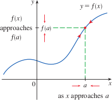
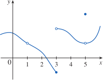
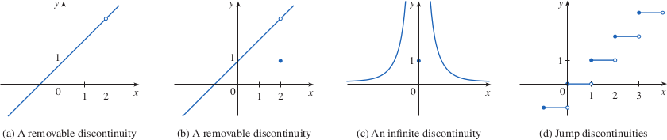

# 1.8: Continuity

## Continuity of a Function
- The limit of a function as $x$ approaches $a$ can often by found by just calculating the value of the function at $a$
  - Functions with this property are called *continuous at $a$*
- A function $f$ is **continuous at a number $a$** if $$\lim_{x \to a} = f(a)$$
  - This definition requires three things:
    1. $f(a)$ is defined ($a$ is in the domain of $f$)
    2. $\lim_{x \to a}f(x)$ exists
    3. $\lim_{x \to a}f(x) = f(a)$
- 
- A function is called **discontinuous at $a$** if $f$ is not continuous at $a$
- 
- Functions may be discontinuous if they break any of the three rules above
- 
- Discontinuities are called removable if we can remove the discontinuity be redefining $f$ at just a single number
- A function $f$ is **continuous from the right at a number $a$** if $\lim_{x \to a^+}f(x) = f(a)$ and $f$ is **continuous from the left at $a$** if $\lim_{x \to a^-}f(x) = f(a)$
- A function is called **continuous on an interval** if it is continuous at every number in the interval
  - If the function is defined only on one side of an endpoint of the interval, we understand *continuous* at the endpoint to mean *continuous from the right* or *continuous from the left*

## Properties of Continuous Functions
- If $f$ and $g$ are continuous at $a$ and $c$ is a constant, then the following functions are also continuous at $a$
  - $f + g$
  - $f - g$
  - $cf$
  - $fg$
  - $\frac{f}{g}$ if $g(a) \ne 0$
- Any polynomial is continuous everywhere; that is, it is continuous on $\mathbb{R} = (-\infty, \infty)$
- Any rational function is continuous wherever it is defined; that is, it is continuous on its domain
- Most familiar functions are continuous at every number in their domains
- The following types of functions are continuous at every number in their domains
  - polynomials
  - rational functions
  - root functions
  - trigonometric functions
- If $f$ is continuous at $b$ and $\lim_{x \to a}g(x) = b$, then $\lim_{x \to a}f(g(x)) = f(b)$. In other words, $$\lim_{x \to a}f(g(x)) = f(\lim_{x \to a}g(x))$$
  - This says that the limit symbol can be moved through a function symbol if the function is continuous and the limit exists
- If $g$ is continuous at $a$ and $f$ is continuous at $g(a)$, then the composite function $f \circ g$ given by $(f \circ g)(x) = f(g(x))$ is continuous at $a$
  - Can be expressed informally as "a continuous function of a continuous function is a continuous function"

## The Intermediate Value Theorem
- Suppose that $f$ is continuous on the closed interval $[a, b]$ and let $N$ be any number between $f(a)$ and $f(b)$, where $f(a) \ne f(b)$. Then there exists a number $c$ in $(a, b)$ such that $f(c) = N$
- The intermediate value theorem states that a continuous function takes on every intermediate value between the function values $f(a)$ and $f(b)$
- Thinking of the graph of a function which has no holes or breaks, this is easy to believe that it is true
- The function for this theorem must be continuous, this theorem is not true for discontinuous functions