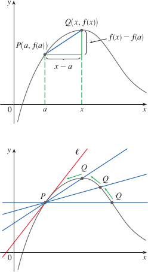
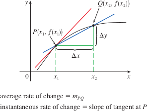

# 2.1: Derivatives and Rates of Change

## Tangents
- Given a curve, $C$, with an equation $y = f(x)$, to find the tangent line for $C$ at the point $P(a, f(a))$, we take a nearby point $Q(x, f(x))$ (where $x \ne a$) and compute the slope of the secant line $PQ$ $$m_{PQ} = \frac{f(x) - f(a)}{x - a}$$
- Then we have $Q$ approach $P$ along the curve (by letting $x$ approach $a$)
- We define the tangent line $l$ to be the line through $P$ with slope $m$
- 
- Find the equation of the tangent line to the parabola $y = x^2$ at the point $P(1, 1)$
  - $a = 1$ and $f(x) = x^2$, so the slope of the tangent line is $m = \lim_{x \to 1}\frac{f(x) - f(1)}{x - 1} = \lim_{x \to 1}\frac{x^2 - 1}{x - 1}$
  - $= \lim_{x \to 1}\frac{(x - 1)(x + 1)}{x - 1}$
  - $= \lim_{x \to 1}(x + 1) = 1 + 1 = 2$
  - We can use point-slope form the line equation: $y - y_1 = m(x - x_1)$
    - $y - 1 = 2(x - 1)$ or $y = 2x - 1$
- Sometimes the slope of the tangent line is called the **slope of the curve** at the point
- Another expression for the slope of the tangent line, if $h = x - a$, then $x = a + h$, so the slope of the secant line $PQ$ is $$m_{PQ} = \frac{f(a + h) - f(a)}{h}$$
- This expression for the slope of the tangent line can be written as $$m = \lim_{h \to 0}\frac{f(a + h) - f(a)}{h}$$

## Velocities
- The **instantaneous velocity** of an object with position function $f(t)$ at time $t = a$ is $$v(a) = \lim_{h \to 0}\frac{f(a + h) - f(a)}{h}$$ provided that this limit exists
- This means the velocity at time $t = a$ is equal to the slope of the tangent line $P$

## Derivatives
- The same type of limit arises in finding the slope of a tangent line or the velocity of an object
- Limits of the form $$\lim_{h \to 0}\frac{f(a + h) - f(a)}{h}$$ arise whenever we calculate the rate of change in any of the sciences or engineering
- The **derivative of a function $f$ at a number $a$**, denoted by $f'(a)$, is $$f'(a) = \lim_{h \to 0}\frac{f(a + h) - f(a)}{h}$$ if this limit exists
  - $f'(a)$ is "f prime of a"
- If we write $x = a + h$, then we also have $h = x - a$, and $h$ can only approach 0 if $x$ approaches $a$
- An equivalent way of stating the derivative is $$f'(a) = \lim_{x \to a}\frac{f(x) - f(a)}{x - a}$$
- Remember that the tangent line to the curve $y = f(x)$ at the point $P(a, f(a))$ to be the line that passes through $P$ and has slope $m$.
- This is the same as the derivative $f'(a)$, so we can say "the tangent line to $y = f(x)$ at $(a, f(a))$ is the line through $(a, f(a))$ whose slope is equal to $f'(a)$, the derivative of $f\text{ at }a$"
- Using point-slope form of the equation of aline, we can write the equation of the tangent line as $y - f(a) = f'(a)(x - a)$

## Rates of Change
- If $y$ is a quantity that depends on $x$, then $y$ is a function of $x$ and we can write $y = f(x)$.
- If $x$ changes from $x_1$ to $x_2$, then the change in $x$ (called the **increment** of $x$) is $\Delta x = x_2 - x_1$
- The corresponding change in $y$ is $\Delta y = f(x_2) - f(x_1)$
- The difference quotient is $\frac{\Delta y}{\Delta x} = \frac{f(x_2) - f(x_1)}{x_2 - x_1}$ is called the **average rate of change of $y$ with respect to $x$** over the interval $[x_1, x_2]$ and can be interpreted as the slope of the secant line $PQ$
- 
- Similar to velocity, looking at the average rate of change over smaller and smaller intervals ($x_2$ approaches $x_1$, $\Delta x$ approaches 0), gives us a limit called the **(instantaneous) rate of change of $y$ with respect to $x$** at $x = x_1$. This is the slope of the tangent line to the curve $y = f(x)$ at $P(x_1, f(x_1))$
- $$\text{instantaneous rate of change} = \lim_{\Delta x \to 0}\frac{\Delta y}{\Delta x} = \lim_{x_2 \to x_1}\frac{f(x_2) - f(x_1)}{x_2 - x_1}$$
- This limit is the derivative $f'(x_1)$
  - One interpretation of the derivative is as the slope of the tangent line to the curve $y = f(x)$ when $x = a$
  - Another interpretation of the derivative $f'(a)$ is the instantaneous rate of change of $y = f(x)$ with respect to $x$ when $x = a$
- If the derivative is large (the curve is steep at point $P$), the $y$-values change rapidly
- If the derivative is small (the curve is flatter at point $P$), the $y$-values change slowly