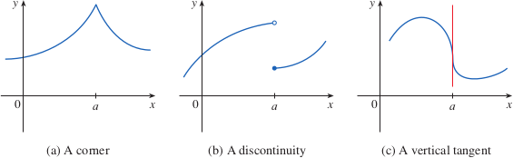

# 2.2: The Derivative as a Function

## The Derivative Function
- For derivatives of function $f$ at a fixed number $a$: $$f'(a) = \lim_{h\to0} \frac{f(a + h) - f(a)}{h}$$
- If we let $a$ vary, we replace it in the equation above with the variable $x$: $$f'(x) = \lim_{h\to0} \frac{f(x + h) - f(x)}{h}$$
- Using this function, we describe it as **derivative of $f$**
- $f'(x)$ can be interpreted as the slope of the tangent line to the graph of $f$ at the point $(x, f(x))$
- If we graph the derivative function, we should see that when the graph of $f$ has a slope of 0, the graph of $f'(x)$ crosses the x-axis

## Other Notations
- Other ways to write derivatives include
  - $f'(x) = y' = \frac{dy}{dx} = \frac{df}{dx} = \frac{d}{dx}f(x) = Df{x} = D_xf(x)$
  - These are all equivalent
- Symbols $D$ and $d/dx$ are **differential operators** that indicate **differentiation** (which is the process of calculating a derivative)
- A function is **differentiable** at $a$ if $f'(a)$ exists. It is **differentiable on an open interval** if it is differentiable on every number in the interval
- If $f$ (a function) is differentiable at $a$, then $f$ is continuous at $a$

## How Can a Function Fail To Be Differentiable?
- A function will fail to be differentiable if it has a "corner" in it, the function will have no tangent at this point (and thus not be differentiable), because the right and left hand limits are different
- Any function that has a discontinuity will fail to be differentiable at that point
- Another possibility is that a curve that has a vertical tangent line will fail to be differentiable
- 

## Higher Derivatives
- If $f$ is a differentiable function, then its derivative $f'(x)$ is also a function, which means it will have a derivative of its own (denoted with $(f')' = f''$)
  - This particular derivative is called the **second derivative**
  - This second derivative is the "rate of change of the rate of change"
- One can continue to calculate third, fourth derivatives and onward
- Typically represented as $y^{(n)} = f^{(n)}(x) = \frac{d^ny}{dx^n}$
