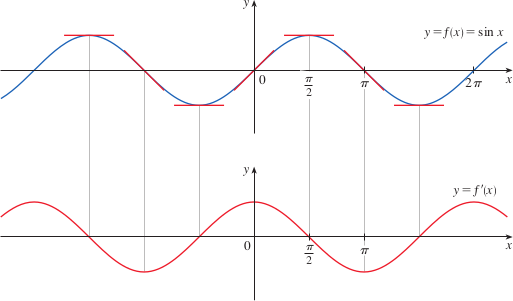

# 2.4: Derivatives of Trigonometric Functions
- Remember that for trig functions, $f(x) = \sin x$ means the sine of an angle whose radian measure is x (no degrees)
- Also remember that trig functions are continuous at every number in their domains

## Derivatives of the Trigonometric Functions
- If you draw the graph of the function $f(x) = \sin x$ and then graph the derivative $y = f'(x)$, then we see that $f'$ is very similar (the same) as the cosine curve
- 
- Example: differentiate $y = x^2\sin x$
  - First use the product rule, $y' = f' \cdot g + f \cdot g'$
    - $\frac{dy}{dx} = x^2\frac{d}{dx}(\sin x) + \sin x\frac{d}{dx}(x^2)$
  - Because we already know the derivative of $\sin x$ is $\cos x$, we can substitute that and use the power rule on $\frac{d}{dx}x^2$
    - $x^2\cos x + 2x\sin x$
- $\frac{d}{dx}(\cos x) = -\sin x$
- Differentiation of tangent function
  - $\frac{d}{dx}(\tan x) = \frac{d}{dx}(\frac{\sin x}{\cos x})$
  - $\frac{\cos x\frac{d}{dx}(\sin x) - \sin x\frac{d}{dx}(\cos x)}{\cos^2 x}$
  - $\frac{\cos x \cdot \cos x - \sin x(-\sin x)}{\cos^2 x}$
  - $\frac{\cos^2 + \sin^2x}{\cos^2x}$ remember that $(\cos^2x + \sin^2x = 1)$
  - $\frac{1}{\cos^2x} = \sec^2x$
  - $\frac{d}{dx}(\tan x) = \sec^2x$
- Derivatives of all trig functions are shown below, remember, they only work when $x$ is in radians

| Original function      | Derivative       |
|------------------------|------------------|
| $\frac{d}{dx}(\sin x)$ | $\cos x$         |
| $\frac{d}{dx}(\cos x)$ | $-\sin x$        |
| $\frac{d}{dx}(\tan x)$ | $\sec^2x$        |
| $\frac{d}{dx}(\csc x)$ | $-\csc x \cot x$ |
| $\frac{d}{dx}(\sec x)$ | $\sec x \tan x$  |
| $\frac{d}{dx}(\cot x)$ | $-\csc^2 x$      |
- Notice that minus signs go with the derivatives of the "cofunctions" (cosine, cosecant, cotangent)
- Trig functions are often used to model real-world phenomena, such as vibrations, waves, etc.

## Two Special Trigonometric Limits
- $$\lim_{\theta \to 0}\frac{\sin\theta}{\theta} = 1$$
- $$\lim_{\theta \to 0}\frac{\cos\theta - 1}{\theta} = 0$$
