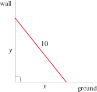
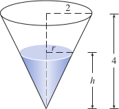
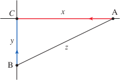
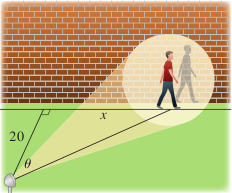

# 2.8: Related Rates
- In related rates problems, the idea is to compute the rate of change of one quantity in terms of the rate of change in another quantity (which may be more easily measured)
- The procedure is to find an equation that relates the two quantities and then use the chain rule to differentiate both sides with respect to time
- Example: air is being pumped into spherical balloon, volume increases at a rate of 100 $cm^3/s$, how fast is radius increasing when diameter is 50cm?
  - Identify given information: rate of increase of volume of air is 100 $cm^3/s$
  - Identify the unknown: rate of increase of the radius when the diameter is 50cm
  - Let $V$ be the volume of the balloon and $r$ be its radius
  - Important to remember that rates of change are derivatives; the volume and radius are both functions of the time $t$
    - Rate of increase of the volume with respect to time is the derivative $dV/dt$ and the rate of increase of the radius is $dr/dt$
  - Restate given and unknown
    - Given: $\frac{dV}{dt} = 100cm^3/s$
    - Unknown: $\frac{dr}{dt}$ when $r = 25\ cm$
  - We need to connect the given $\frac{dV}{dt}$ and the unknown $\frac{dr}{dt}$
    - First need to relate $V$ and $r$ by a formula, here the volume of a sphere
      - $V = \frac{4}{3}\pi r^3
    - Then we need to differentiate each side of the equation with respect to $t$
      - $\frac{dV}{dt} = \frac{dV}{dr}\frac{dr}{dt} = 4\pi r^2\frac{dr}{dt}$
    - Next you solve for the unknown quantity
      - $\frac{dr}{dt} = \frac{1}{4\pi r^2}\frac{dV}{dt}$
    - If you put $r = 25$ and $\frac{dV}{dt} = 100$, you get the following
      - $\frac{dr}{dt} = \frac{1}{4\pi 25^2}100 = \frac{1}{25\pi}$
  - Radius of the balloon is increasing at the rate of $1/(25\pi) \approx 0.0127\ cm/s$ when the diameter is 50cm
  - Note that although $\frac{dV}{dt}$ is constant, $\frac{dr}{dt}$ is not
- Example: A 10ft ladder rests against a vertical wall; the bottom slides away from the wall at rate of 4ft/s; how fast is the top of the ladder sliding down the wall when the bottom is 6ft from the wall?
  - Start by drawing a diagram and label the unknowns
    - 
    - $x$ is feet from the bottom of the ladder to the wall, $y$ is feet from the ground to the top of the ladder
    - Given: $\frac{dx}{dt} = 4ft/s$
    - Unknown: $\frac{dy}{dt}$ when $x = 6$ft
  - Connect the given and the unknown, here with the Pythagorean Theorem
    - $x^2 + y^2 = 100$
  - Differentiate each side with respect to $t$ using the chain rule
    - $2x\frac{dx}{dt} + 2y\frac{dy}{dt} = 0$
  - Solve the equation to get the desired rate
    - $\frac{dy}{dt} = -\frac{x}{y}\frac{dx}{dt}$
  - When $x = 6$, Pythagorean theorem gives $y = 8$, so we substitute these values and $\frac{dx}{dt} = 4$
    - $\frac{dy}{dt} = -\frac{6}{8}(4) = -3$ft/s
> ### Problem Solving Strategy
> 1. Read the problem carefully
> 2. Draw a diagram, if possible
> 3. Introduce notation. Assign symbols to all quantities that are functions of time
> 4. Express the given information and the required rate in terms of derivatives
> 5. Write an equation that relates various quantities of the problem
> 6. Use the chain rule to differentiate both sides of the equation with respect to $t$
> 7. Substitute the given information into the resulting equation and solve for the unknown rate
- A common error is to substitute the given numerical information too early, this should only be done after differentiation
- Example: a water tank has a shape of inverted circular cone with base radius of $2m$ and height of $4m$. Water is being pumped into the tank at rate of $2m^3/min$; find rate at which water is rising when the water is 3m deep
  - Draw a diagram and label $V$ (volume of water), $r$ (radius of surface), and $h$ (height of water at time $t$)
  - 
  - Given $\frac{dV}{dt} = 2m^3/min$ and asked to find $\frac{dh}{dt}$ when $h = 3m$
    - Quantities $V$ and $h$ are related by the following formula, but it is useful to express $V$ as a function of $h$ alone
      - $V = \frac{1}{3}\pi r^2 h$
      - Use similar triangles to write
        - $\frac{r}{h} = \frac{2}{4}$ equals $r = \frac{h}{2}$
    - Expression for $V$ becomes
      - $V = \frac{1}{3}\pi(\frac{h}{2})^2h = \frac{\pi}{12}h^3$
    - Differentiate each side with respect to $t$
      - $\frac{dV}{dt} = \frac{pi}{4}h^2\frac{dh}{dt}$
      - $\frac{dh}{dt} = \frac{4}{\pi h^2}\frac{dV}{dt}$
    - Substitute $h = 3m$ and $\frac{dV}{dt} = 2m^3/min$ we get
      - $\frac{dh}{dt} = \frac{4}{\pi(3)^2}\cdot 2 = \frac{8}{9\pi}$
  - So, we find that the water level is rising at a rate of $\frac{8}{9\pi} \approx 0.28m/min$
- Example: car A traveling west at 50mph and car B traveling north at 60mph. Both are heading towards the intersection, at what rate are the cars approaching each other when car A is 0.3 mi and car B is 0.4 mi from the intersection
  - Draw a diagram and label points, $C$ is the intersection
  - 
  - At a given time $t$, let $x$ be the distance from $A$ to $C$, $y$ is the distance from $B$ to $C$, and $z$ is the distance between the cars
  - $\frac{dx}{dt} = -50mi/h$ and $\frac{dy}{dt} = -60mi/h$, we need to find $\frac{dz}{dt}$
  - Relate the variables to each other with the Pythagorean theorem
    - $z^2 = x^2 + y^2$
  - Differentiate each side with respect to $t$
    - $2z\frac{dz}{dt} = 2x\frac{dx}{dt} + 2y\frac{dy}{dt}$
    - $\frac{dz}{dt} = \frac{1}{z}(x\frac{dx}{dt} + y\frac{dy}{dt})$
  - Now that we have differentiated, we can plug in our known values; Pythagorean theorem gives us $z = 0.5$
    - $\frac{dz}{dt} = \frac{1}{0.5}[0.3(-50) + 0.4(-60)] = -78mph$
- Example: man walks along straight path at speed of 4ft/s, spotlight is located on ground 20ft from path, keeps focus on man. What rate is the spotlight rotating when the man is 15ft from the point on the path closest to the light
  - Draw a diagram and label the points, $x$ is the distance between the man and point on the path closest to the spotlight, $\theta$ is the angle between the beam of light and the perpendicular to the path
  - 
  - Given: $\frac{dx}{dt} = 4ft/s$
  - Unknown: $\frac{d\theta}{dt}$ when $x = 15$
  - Equation that relates $x$ and $\theta$
    - $\frac{x}{20} = \tan\theta; x = 20\tan\theta$
  - Differentiate each side with respect to $t$
    - $\frac{dx}{dt} = 20\sec^2\theta\frac{d\theta}{dt}$
    - $\frac{d\theta}{dt} = \frac{1}{20}\cos^2\theta\frac{dx}{dt}$
    - $= \frac{1}{20}\cos^2\theta(4) = \frac{1}{5}\cos^2\theta$
  - When $x = 15$, the length of the beam is 25, so $\cos\theta = \frac{20}{25} = \frac{4}{5}$
    - $\frac{d\theta}{dt} = \frac{1}{5}(\frac{4}{5})^2 = \frac{16}{125} = 0.128$
  - Spotlight is rotating at a rate of 0.128 rad/s