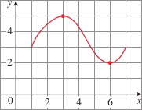
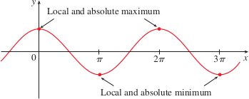
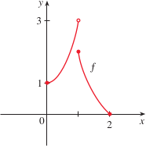
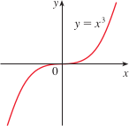

# 3.1: Maximum and Minimum Values
- Important applications of differential calculus are *optimization problems*, where we are looking for the best way of doing something. This can be reduced to finding the maximum or minimum values of a function

## Absolute and Local Extreme Values
- 
- In the graph above, the highest point is (3, 5), while the lowest point is (6, 2)
  - This means that the largest value of $f$ is $f(3) = 5$, while the smallest value is $f(6) = 2$
  - This largest value is the *absolute maximum* and the smallest value is the *absolute minimum*
- Definition: Let $c$ be a number in the domain $D$ of a function $f$. Then $f(c)$ is the
  - **absolute maximum** value of $f$ on $D$ if $f(c) \geq f(x)$ for all $x$ in $D$
  - **absolute minimum** value of $f$ on $D$ if $f(c) \leq f(x)$ for all $x$ in $D$
- Absolute max/mins are sometimes called **global** maximum/minimum. These are also called **extreme values** of $f$
- In addition to absolute max/min, we also have local max/min values
- Definition: The number $f(c)$ is a 
  - **local maximum** value of $f$ if $f(c) \geq f(x)$ when $x$ is near $c$
  - **local minimum** value of $f$ if $f(c) \leq f(x)$ when $x$ is near $c$
  - When we say that something is true "near" $c$, it means it is true on some open interval containing $c$
  - The local max/min values cannot occur at an endpoint
- 
  - As shown in the graph above, there can be multiple points that correspond to the absolute max/min (if they are the same)
- Some functions have extreme values, but others do not
- The extreme value theorem gives conditions under which a function is guaranteed to possess extreme values
- **The Extreme Value Theorem**
  - If $f$ is continuous on a closed interval $[a, b]$, then $f$ attains an absolute maximum value and an absolute minimum value at some numbers in $[a, b]$
  - You can take the extreme value theorem more than once at different points of the function
  - If a function does not meet the criteria for the extreme value theorem, then it is not guaranteed to have maximum/minimum values
  - 
  - Functions that are discontinuous may have absolute maximum/minimum values, but are not guaranteed

## Critical Numbers and the Closed Interval Method
- Extreme value theorem tells us that continuous functions on closed intervals have maximum and minimum values, but it doesn't tell us how to find them
- At local maximum/minimum values for differentiable functions, the derivative of the slope of the tangent line is 0
- **Fermat's Theorem**
  - If $f$ has a local maximum or minimum at $c$, and if $f'(c)$ exists, then $f'(c) = 0$
  - This does not always mean that we can find a local max/min wherever the slope of the tangent line is zero, see the example figure below
  - 
- Though Fermat's Theorem is not *always* true, it does suggest that we should start looking for extreme values where the $f'(c) = 0$ or $f'(c)$ does not exist
  - These numbers are called **critical numbers**
- **Critical number** of a function $f$ is a number $c$ in the domain of $f$ such that either $f'(c) = 0$ or $f'(c)$ does not exist
- We can rephrase Fermat's Theorem as "if $f$ has a local maximum or minimum at $c$, then $c$ is a critical number of $f$"
- To find absolute maximum/minimum of a continuous function $f$ on a closed interval $[a, b]$, follow the Closed Interval Method
  1. Find the values of $f$ at the critical numbers of $f$ in $(a, b)$
  2. Find the values of $f$ at the endpoints of the interval
  3. The largest of the values from steps 1 and 2 is the absolute maximum value, the smallest of these values is the absolute minimum value