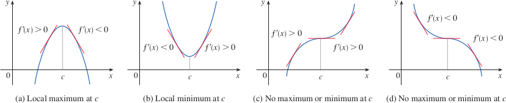
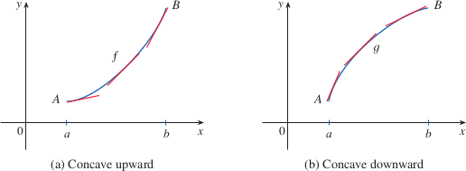
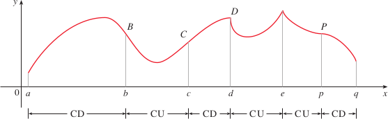

# What Derivatives Tell Us about the Shape of a Graph

## What does $f'$ say about $f$?
- We can use the Mean Value Theorem to prove that a function is increasing or decreasing in between points where there is a positive/negative slope
  - If $f'(x) \gt 0$ on an interval, then $f$ is increasing on that interval
  - If $f'(x) \lt 0$ on an interval, then $f$ is decreasing on that interval

## The First Derivative Test
- If $f$ has a local maximum or minimum at $c$, then $c$ must be a critical number of $f$, but not every critical number is a maximum or minimum
  - If the sign of $f'(x)$ changes from positive to negative at $c$, then $f$ has a local maximum at $c$
  - If the sign of $f'(x)$ changes from negative to positive at $c$, then $f$ has a local minimum at $c$
  - If the sign of $f'(x)$ does not change at $c$, then $f$ has no local maximum or minimum at $c$
  - 

## What does $f''$ say about $f$?
- Different types of curves can be drawn, such as *concave upward* and *concave downward*
- 
- If the graph of $f$ lies above all of its tangents on an interval $I$, then $f$ is called **concave upward** on $I$. If the graph of $f$ lies below all of its tangents on $I$, then $f$ is called **concave downward** on $I$
- 
- Concavity Test
  - If $f''(x) \gt 0$ on an interval $I$, then the graph of $f$ is concave upward on $I$
  - If $f''(x) \lt 0$ on an interval $I$, then the graph of $f$ is concave downward on $I$
- The point where the curve of a graph changes from concave upward to concave downward is called the *inflection point* of the curve. This is a point where a curve changes its direction of concavity
- Definition: A point $P$ on a curve $y = f(x)$ is called an **inflection point** if $f$ is continuous there and the curve changes from concave upward to concave downward or from concave downward to concave upward at $P$
- If figure 3.3.8 (above), points $B,C,D,P$ are points of inflection
- There is a point of inflection at any point where the function is continuous and the second derivative changes sign

## The Second Derivative Test
- An alternative to the first derivative test for identifying local maximum and minimum values is the second derivative test
- **Second Derivative Test**
  - Suppose $f''$ is continuous near $c$
    - If $f'(c) = 0$ and $f''(c) \gt 0$, then $f$ has a local minimum at $c$
    - If $f'(c) = 0$ and $f''(c) \lt 0$, then $f$ has a local maximum at $c$
- The second derivative test is inconclusive when $f''(c) = 0$, at that point, there might be a maximum/minimum, or neither.
- The second derivative test is also inconclusive when $f''(c)$ does not exist
- First derivative test is often easier to use
