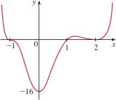

# 3.4: Limits at Infinity; Horizontal Asymptotes

## Limits at Infinity and Horizontal Asymptotes
- Starting with the example of $$f(x) = \frac{x^2 - 1}{x^2 + 1}$$ we want to investigate the behavior of the function as $x$ becomes large
- 
- We see that the values of $f(x)$ approach 1 when we make $x$ sufficiently large
- $$\lim_{x \to \infty}\frac{x^2 - 1}{x^2 + 1} = 1$$
> ### Intuitive Definition of a Limit at Infinity
> - Let $f$ be a function defined on some interval $(a, \infty)$. Then $$\lim_{x \to \infty}f(x) = L$$ means the values of $f(x)$ can be made arbitrarily close to $L$ by requiring $x$ to be sufficiently large
- There are a number of ways that the graph of $f$ can approach $y = L$, or the horizontal asymptote
- 
> ### Definition
> - Let $f$ be a function defined on some interval $(-\infty, a)$. Then $$\lim_{x \to -\infty}f(x) = L$$ means that the values of $f(x)$ can be made arbitrarily close to $L$ by requiring $x$ to be sufficiently large negative
- Similar to the horizontal asymptote for positive infinity, there are a number of ways that the graph of $f$ can approach $L$
> ### Definition
> - The line $y = L$ is called a **horizontal asymptote** of the curve $y = f(x)$ if either $$\lim_{x \to \infty}f(x) = L$$ or $$\lim_{x \to -\infty}f(x) = L$$

## Evaluating Limits at Infinity
- The limit laws that were previously specified (in section 1.6) also hold for limits at infinity and can be proved (with the exception of laws 10/11) by replacing $x \to a$ with $x \to \infty$ or $x \to -\infty$
> ### Theorem
> - If $r \gt 0$ is a rational number, then $$\lim_{x \to \infty}\frac{1}{x^r} = 0$$
> - If $r \gt 0$ is a rational number such that $x^r$ is defined for all $x$, then $$\lim_{x \to -\infty}\frac{1}{x^r} = 0$$
- To evaluate the limit at infinity of any rational function, we first divide both the numerator and denominator by the highest power of $x$ that occurs in the denominator
- Example
  - $\lim_{x \to \infty}\frac{3x^2 - x - 2}{5x^2 + 4x + 1}$
  - Divide by highest power of $x$ that occurs in the denominator
  - $\lim_{x \to \infty}\frac{3x^2 - x - 2}{5x^2 + 4x + 1} = \lim_{x \to \infty}\frac{\frac{3x^2 - x - 2}{x^2}}{\frac{5x^2 + 4x + 1}{x^2}} = \lim_{x \to \infty}\frac{3 - \frac{1}{x} - \frac{2}{x^2}}{5 + \frac{4}{x} + \frac{1}{x^2}}$
  - $= \frac{\lim_{x \to \infty}(3 - \frac{1}{x} - \frac{2}{x^2})}{\lim_{x \to \infty}(5 + \frac{4}{x} + \frac{1}{x^2})}$
  - $= \frac{\lim_{x \to \infty}3 - \lim_{x \to \infty}\frac{1}{x} - 2\lim_{x \to \infty}\frac{1}{x^2}}{\lim_{x \to \infty}5 + 4\lim_{x \to \infty}\frac{1}{x} + \lim_{x \to \infty}\frac{1}{x^2}}$
  - $= \frac{3 - 0 - 0}{5 + 0 + 0} = \frac{3}{5}$
  - 
- Example
  - $\lim_{x \to \infty}(\sqrt{x^2 + 1} - x)$
  - Here we need to first rewrite the function using algebra, multiplying by the conjugate
  - $\lim_{x \to \infty}(\sqrt{x^2 + 1} - x) \cdot \frac{\lim_{x \to \infty}(\sqrt{x^2 + 1} + x)}{\lim_{x \to \infty}(\sqrt{x^2 + 1} + x)}$
  - $ = \lim_{x \to \infty}\frac{(x^2 + 1) - x^2}{\sqrt{x^2 + 1} + x} = \lim_{x \to \infty}\frac{1}{\sqrt{x^2 + 1} + x}$
  - Because the denominator of this new expression becomes large as $x \to \infty$, our final result is $$\lim_{x \to \infty}(\sqrt{x^2 + 1} - x) = \lim_{x \to \infty}\frac{1}{\sqrt{x^2 + 1} + x} = 0$$
  - 
- Example
  - $\lim_{x \to \infty}\sin\frac{1}{x}$
  - If we sub $t = 1/x$, then $t \to 0^+\text{ as }x \to \infty$. Therefore $$\lim_{x \to \infty}\sin\frac{1}{x} = \lim_{t \to 0^+}\sin{t} = 0$$
- Example
  - $\lim_{x \to \infty}\sin{x}$
  - As $x$ increases, the values of $\sin{x}$ oscillation between 1 and -1 infinitely, so we don't approach any definite number. Therefore, $\lim_{x \to \infty}\sin{x}$ does not exist

## Infinite Limits at Infinity
- The notation $\lim_{x \to \infty}f(x) = \infty$ is used indicate that values of $f(x)$ become large as $x$ becomes large
  - Similarly, $\lim_{x \to -\infty}f(x) = \infty$, $\lim_{x \to \infty}f(x) = -\infty$, $\lim_{x \to -\infty}f(x) = -\infty$
- Example
  - Find $\lim_{x \to \infty}x^3$ and $\lim_{x \to -\infty}x^3$
  - Whenever $x$ becomes large, $x^3$ also becomes large, so we write $\lim_{x \to \infty}x^3 = \infty$
  - Similarly, when $x$ is a large negative, so is $x^3$, so we write $\lim_{x \to -\infty}x^3 = -\infty$
  - These can be seen in the graph of the function
  - 
- In general, we cannot use the limit laws when working with infinite limits, because $\infty$ is not a number
  - So you cannot apply the limit laws to $lim_{x \to \infty}(x^2 - x)$ (such as the difference law), because you will get $(\infty - \infty)$
  - But, you can write $\lim_{x \to \infty}(x^2 - x) = \lim_{x \to \infty}x(x - 1) = \infty$
    - Both $x$ and $x - 1$ become arbitrarily large, so their product does too
- Example
  - Find $\lim_{x \to \infty}\frac{x^2 + x}{3 - x}$
  - Divide the numerator and denominator by the highest power of $x$ in the denominator
  - $\lim_{x \to \infty}\frac{x^2 + x}{3 - x} = \lim_{x \to \infty}\frac{x + 1}{\frac{3}{x} - 1} = -\infty$
  - Because $x + 1 \to \infty$ and $3/x - 1 \to 0 - 1 = -1$ as $x \to \infty$, we get $-\infty$
- Example
  - Sketch the graph of $y = (x - 2)^4(x + 1)^3(x - 1)$ by finding its intercepts and its limits as $x \to \infty$ and $x \to -\infty$
  - y-intercept (set $x = 0$) is $f(0) = (-2)^4(1)^3(-1) = -16
  - x-intercepts (set $y = 0$) are $x = 2, -1, 1$
    - Important to note that $(x - 2)^4$ has a multiplicity of 4, so it does not cross the x-axis, but "bounces off"
  - When $x$ is a large positive, all three factors are large positives, so $$\lim_{x \to \infty}(x - 2)^4(x + 1)^3(x - 1) = \infty$$
  - When $x$ is a large negative, first factor is large positive, and second/third factors are large negatives, so $$\lim_{x \to \infty}(x - 2)^4(x + 1)^3(x - 1) = \infty$$
  - 

## Precise Definitions
> ### Precise Definition of a Limit at Infinity
> - Let $f$ be a function defined on some interval $(a, \infty)$.
> - Then $\lim_{x \to \infty}f(x) = L$ means that for every $\epsilon \gt 0$ there is a corresponding number $N$ such that if $x \gt N$ then $|f(x) - L| \lt \epsilon$
- This means that values of $f(x)$ can be made arbitrarily close to $L$ by requiring $x$ to be sufficiently large
> ### Definition
> - Let $f$ be a function defined on some interval $(-\infty, a)$.
> - Then $\lim_{x \to -\infty}f(x) = L$ means that for every $\epsilon \gt 0$ there is a corresponding number $N$ such that if $x \lt N$ then $|f(x) - L| \lt \epsilon$

> ### Precise Definition of an Infinite Limit at Infinity
> - Let $f$ be a function defined on some interval $(a, \infty)$
> - Then $\lim_{x \to \infty}f(x) = \infty$ means that for every positive number $M$ there is a corresponding positive number $N$ such that if $x \gt N$ then $f(x) \gt M$