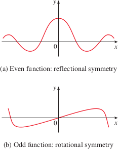
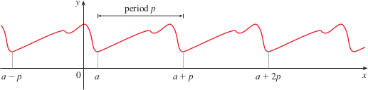

# 3.5: Summary of Curve Sketching
- Particularly important aspects of curve sketching
  - Domain, range, symmetry, limits, continuity, vertical asymptotes, derivatives, tangents, extreme values, intervals of increase and decrease, concavity, points of inflection, and horizontal asymptotes

## Guidelines for Sketching a Curve
- Use the following checklist as a guide to sketching a curve $y = f(x)$ by hand
  - But remember, not all items are relevant to every function
1. **Domain**: It's often useful to start by determining the domain ($D$) of $f$, or the set of values of $x$ for which $f(x)$ is defined
2. **Intercepts**: The y-intercept is $f(0)$ and this tells us where the curve intersects the y-axis. To find the x-intercepts, we set $y = 0$ and solve for $x$
3. **Symmetry**
   - If $f(-x) = f(x)$ for all $x$ in $D$, that is, the equation of the curve is unchanged when $x$ is replaced by $-x$, then $f$ is an *even function* (reflectional symmetry) and the curve is symmetric about the y-axis.
     - Examples include $y = x^2$, $y = x^4$, $y = |x|$, and $y = \cos{x}$
   - If $f(-x) = -f(x)$ for all $x$ in $D$, then $f$ is an *odd function* (rotational symmetry) and the curve is symmetric about the origin
     - Examples include $y = x$, $y = x^3$, $y = 1/x$, and $y = \sin{x}$
   - 
   - If $f(x + p) = f(x)$ for all $x$ in $D$, where $p$ is a positive constant, then $f$ is a **periodic function** and the smallest such number $p$ is called the **period**
     - Examples include $y = \sin{x}$, which has a period of $2\pi$ and $y = \tan{x}$ which has a period of $\pi$
   - 
4. **Asymptotes**
   - *Horizontal Asymptotes*: if either $\lim_{x \to \infty}f(x) = L$ or $\lim_{x \to -\infty} = L$, then the line $y = L$ is a horizontal asymptote of the curve $y = f(x)$
     - If $\lim_{x \to \infty}f(x) = \infty\text{ or }-\infty$ then there is no asymptote, but this still helps us sketch the curve
   - *Vertical Asymptotes*: the line $x = a$ is a vertical asymptote if at least one of the following is true
     - $\lim_{x \to a^+}f(x) = \infty$
     - $\lim_{x \to a^+}f(x) = -\infty$
     - $\lim_{x \to a^-}f(x) = \infty$
     - $\lim_{x \to a^-}f(x) = -\infty$
     - For rational functions, can local vertical asymptotes by equating denominator to 0 after canceling common factors
   - *Slant Asymptotes*: to be discussed soon
5. **Intervals of Increase or Decrease**: Use the I/D test, compute $f'(x)$ and find the intervals on which $f'(x)$ is positive ($f$ is increasing) and the intervals on which $f'(x)$ is negative ($f$ is decreasing)
6. **Local Maximum or Minimum Values**
   - Find critical numbers of $f$, which are the numbers where $f'(c) = 0$ or $f'(c)$ does not exist
   - Use the First Derivative test
     - If $f'$ changes from negative to positive at $c$, then $f(c)$ is a local minimum.
     - If $f'$ changes from positive to negative as $c$, then $f(c)$ is a local maximum.
   - Preferred to use the First Derivative Test, but can also use Second Derivative Test if $f'(c) = 0$ and $f''(c) \ne 0$
     - Then $f''(c) \gt 0$ implies that $f(c)$ is a local minimum whereas $f''(c) \lt 0$ implies that $f(c)$ is a local maximum
7. **Concavity and Points of Inflection**
   - Compute $f''(x)$ and use the Concavity Test
   - The curve is concave upward where $f''(x) \gt 0$ and concave downward where $f''(x) \lt 0$
   - Inflection points occur where the direction of concavity changes
8. **Sketch the Curve**
   - Use the information from the previous items to draw the graph
   - Sketch asymptotes as dashed lines
   - Plot intercepts, maximum and minimum points, and inflection points
   - Make the curve pass through these points, using the intervals of increase/decrease and concavity

## Slant Asymptotes
- Some curves have asymptotes that are *oblique*, which are neither horizontal or vertical
- If $\lim_{x \to \infty}[f(x) - (mx + b)] = 0$ where $m \ne 0$, then the line $y = mx + b$ is a slant asymptote
- For rational functions, slant asymptotes occur when the degree of the numerator is one more than the degree of the denominator
  - For these cases, the equation of the slant asymptote can be found by long division
