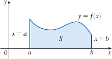
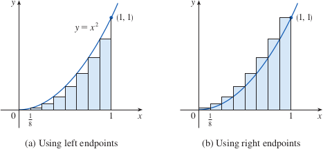
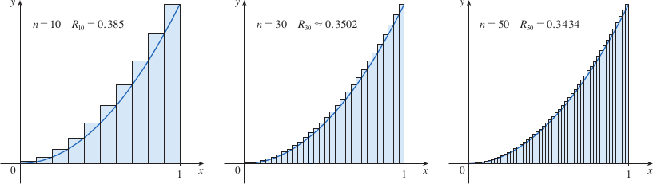
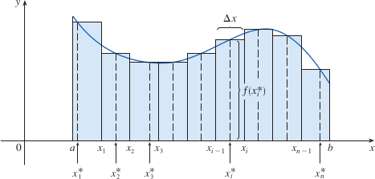

# 4.1: The Area and Distance Problems

## The Area Problem
- The *area problem* is finding the area of the region $S$ that lies under the curve $y = f(x)$ from $a$ to $b$
- $S$ is bounded by the graph of the continuous function $f$ where $f(x) \geq 0$, the vertical lines $x = a$ and $x = b$, and the x-axis
- 
- We need to find a precise definition of the area, we can start by thinking about how we approximated the slope of the tangent line by slopes of secant lines
- First approximate the region $S$ by rectangles, then we take the limit of the sum of the areas as we increase the number of rectangles
- As we increase the number of rectangles, we can get closer to the true area
- 
- 
- Each rectangle, or "strip" that we add into our figure, can be specified with $S_1, S_2,..., S_n$
- The width of the interval $[a, b]$ is $b - a$, so the width of each of our strips is $$\Delta = \frac{b-a}{n}$$
- These strips divide the interval $[a, b]$ into $n$ subintervals, which are specified as $$[x_0, x_1], [x_1, x_2], [x_2, x_3],...,[x_{n-1}, x_n]$$ where $x_0 = a$ and $x_n = b$. The right endpoints of each subinterval are $$x_1 = a + \Delta x$$ $$x_2 = a + 2\Delta x$$ $$x_3 = a + 3\Delta x$$ etc. In general, this is $x_i = a + \Delta x$
> ### Definition
> The **area** $A$ of the region $S$ that lies under the graph of the continuous function $f$ is the limit of the sum of the areas of approximating rectangles: $$A = \lim_{n \to \infty}R_n = \lim_{n \to \infty}[f(x_1)\Delta x + f(x_2)\Delta x + ... + f(x_n)\Delta x]$$
- The limit, as specified in our definition, always exists, since $f$ is continuous. You can also get the same value using the left endpoints of the rectangles $$A = \lim_{n \to \infty}L_n = \lim_{n \to \infty}[f(x_0)\Delta x + f(x_1)\Delta x + ... + f(x_{n-1})\Delta x]$$
- Instead of using endpoints, we can also use the height of the $i$th rectangle at any number $x_{1}^*$. These numbers, $x_{1}^*, x_{2}^*,..., x_{n}^*$ are called **sample points**
- A more general expression for the area of $S$ is $$a = \lim_{n \to \infty}[f(x_{1}^*)\Delta x + f(x_{2}^*)\Delta x + ... + f(x_{n}^*)\Delta x]$$
- 
- Often, we will use **sigma notation** to write sums with many terms more compactly $$\sum_{i=1}^{n} f(x_i)\,\Delta x = f(x_1)\,\Delta x + f(x_2)\,\Delta x + \cdots + f(x_n)\,\Delta x$$

## The Distance Problem
- The distance problem is finding the distance traveled by an object during a certain time period if the velocity of the object is known at all times (in a way, the inverse of the velocity problem)
  - If velocity is constant, easy to solve with $\text{distance }=\text{ velocity }\times\text{ time}$
  - However, velocity can (and often will) vary
- In the same way as we measured the area under the curve by taking the number of rectangles to infinity, we can do the same for distance, by measuring our velocity a greater and greater number of times
- If our velocity is $v = f(t)$ where $a \leq t \leq b$ and $f(t) \geq 0$ (object moving in positive direction), we can take velocity readings at $t_0(=a), t_1, t_2,\cdots,t_n(=b)$
- If these readings are equally spaced, the time between consecutive readings is $\Delta t = (b - a)/n$
- This means the total distance traveled during the time interval $[a, b]$ is approximately $$f(t_0)\Delta t + f(t_1)\Delta t + \cdots + f(t_{n - 1})\Delta t = \sum_{i=1}^{n} f(t_i - 1)\Delta t$$
- The more frequent our readings, the more accurate our estimate becomes, so the exact distance $d$ is the limit $$d = \lim_{n \to \infty}\sum_{i=1}^{n} f(t_{i - 1}) \Delta t = \lim_{n \to \infty}\sum_{i=1}^{n} f(t_i) \Delta t$$
- The distance traveled is the area under the graph of the velocity function