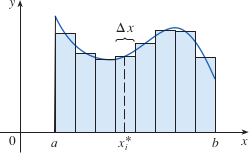
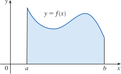
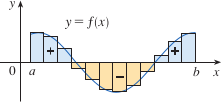
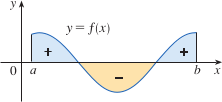
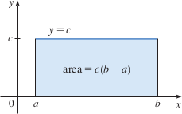
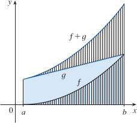
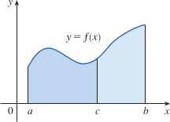
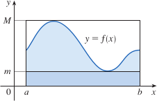

# 4.2: The Definite Integral
- A limit in the form of $$lim_{n \to \infty}\sum_{i=1}^{n}f(x_{i}^*)\Delta x = \lim_{n \to \infty}[f(x_{1}^*)\Delta x+f(x_{2}^*)\Delta x + \cdots + f(x_{n}^*)\Delta x]$$ arises when we compute an area and the distance traveled by an object
- This similar limit can also appear when finding lengths of curves, volumes of solids, centers of mass, force due to water pressure, work, etc.

## The Definite Integral
> ### Definition of a Definite Integral
> - If $f$ is a function defined for $a \leq x \leq b$, we divide the interval $[a, b]$ into $n$ subintervals of equal width $\Delta x = (b - a)/n$. We let $x_0(=a), x_1, x_2, \cdots, x_n(=b)$ be the endpoints of these subintervals and we let $x_1^*, x_2^*, \cdots, x_n^*$ be any **sample points** in these subintervals, so $x_i^*$ lies in the $i$th subinterval $[x_{i-1},x_i]$. Then the definite integral of $f$ from $a$ to $b$ is $$\int_{a}^{b} f(x)\,dx = \lim_{n\to\infty} \sum_{i=1}^{n} f(x_i^{*})\,\Delta x$$ provided that the limit exists and gives the same value for all possible choices of sample points. If it does exist, we say that $f$ is **integrable** on $[a, b]$
- Curiosity: the symbol $\int$ was introduced by Leibniz and is called the "integral sign".
- In the example $\int_a^bf(x)dx$
  - $f(x)$ is called the **integrand**
  - $a$ and $b$ are called the **limits of integration**, $a$ is the **lower limit**, $b$ is the **upper limit**
  - $dx$ indicates the independent variable is $x$ (you can use any letter though)
  - Procedure of calculating an integral is called **integration**
- The sum $$\sum_{i=1}^nf(x_i^*)\Delta x$$ is called a **Riemann sum**
- The definite integral $\int_a^bf(x)dx$ can be interpreted as the area under the curve $y=f(x)$ from $a$ to $b$
- 
  - If $f(x) \geq 0$, the Riemann sum $\Sigma f(x_i^*)\Delta x$ is the sum of the areas of rectangles
- 
  - If $f(x) \geq 0$, the integral $\int_a^b f(x)dx$ is the area under the curve $y=f(x)$ from $a$ to $b$
- If $f$ has positive and negative values, we take the sum of the areas above the x-axis and the *negatives* of the areas below the x-axis
  - This can be interpreted as the **net area**
- 
- 
> ### Theorem
> - If $f$ is continuous on $[a, b]$, or if $f$ has only a finite number of jump discontinuities, then $f$ is integrable on $[a, b]$; that is, the definite integral $\int_a^b f(x)dx$ exists
- To simplify calculations of integrals, we often take the sample points to be the right endpoints
  - If we do that, then $x_i^* = x_i$ and the definition of an integral simplifies as the following
> ### Theorem
> - If $f$ is integrable on $[a, b]$, then $$\int_a^b f(x)dx = \lim_{n \to \infty}\sum_{i=1}^n f(x_i)\Delta x$$ where $$\Delta x = \frac{b - a}{n}$$ and $$x_i = a + i\Delta x$$
- It is important to remember that when we write $$\lim_{n \to \infty}\sum_{i=1}^n f(x_i^*)\Delta x = \int_a^b f(x)dx$$ we are replacing $\lim \Sigma$ with $\int$, $x_i^*$ with $x$, and $\Delta x$ with $dx$

## Evaluating Definite Integrals
- To use a limit to evaluate a definite integral, we need to know how to work with sums
> ### Sums of Powers
> $$\sum_{i=1}^n 1=n$$
> $$\sum_{i=1}^n i = \frac{n(n+1)}{2}$$
> $$\sum_{i=1}^n i^2 = \frac{n(n+1)(2n+1)}{6}$$
> $$\sum_{i=1}^n i^3 = [\frac{n(n+1)}{2}]^2$$
- Simple rules for working with sigma notation
> ### Properties of Sums
> $$\sum_{i=1}^n ca_i = c\sum_{i=1}^n a_i$$
> $$\sum_{i=1}^n(a_i+b_i) = \sum_{i=1}^n a_i + \sum_{i=1}^n b_i$$
> $$\sum_{i=1}^n(a_i-b_i) = \sum_{i=1}^n a_i - \sum_{i=1}^n b_i$$

## The Midpoint Rule
- Often, we will choose $x_i^*$ to be right endpoint of the $i$th subinterval, because it is convenient. But if our purpose is to find an approximation of an integral, it is usually better to use the midpoint of the interval for $x_i^*$
> ### Midpoint Rule
> $$\int_a^b f(x)dx \approx \sum_{i=1}^n f(x_i)\Delta x = \Delta x[f(x_1)+\cdots+f(x_n)]$$
> Where $$\Delta x = \frac{b-a}{n}$$ and $$x_i = \frac{1}{2}(x_{i-1}+x_i) = \text{midpoint of }[x_{i-1},x_i]$$

## Properties of the Definite Integral
- When we defined the definite integral $\int_a^b f(x)dx$, we assumed that $a \lt b$, but it can still work with $a \gt b$. So we can say that $$\int_b^a f(x)dx = -\int_a^b f(x)dx$$
- If $a = b$, then $\Delta x = 0$, so $\int_a^a f(x)dx = 0$
> ### Properties of the Integral
> 1. $\int_a^b c\ dx = c(b-1)$ where $c$ is any constant
> 2. $\int_a^b [f(x) + g(x)]dx = \int_a^b f(x)dx + \int_a^b g(x)dx$
> 3. $\int_a^b cf(x)\ dx = c\int_a^b f(x)\ dx$ where $c$ is any constant
> 4. $\int_a^b [f(x) - g(x)]\ dx = \int_a^b f(x)\ dx - \int_a^b g(x)\ dx$
> 5. $\int_a^c f(x)\ dx + \int_c^b f(x)\ dx = \int_a^b f(x)\ dx$
- Property 1 says the integral of a constant function is the constant times the length of the interval
  - 
- Property 2 says the integral of a sum is the sum of the integrals
  - 
- Property 3 says the integral of a constant times a function is the constant times the integral of the function
  - A constant (but **only** a constant) can be taken in front of an integral sign
- Property 5 can be seen as the addition of areas under the curve in the example below
  - 
- Properties 1, 2, 3, 4, 5 are true whether $a \lt b$, $a=b$, or $a \gt b$
- The properties below are only true if $a \leq b$
> ### Comparison Properties of the Integral
> 6. If $f(x) \geq 0$ for $a \leq x \leq b$, then $\int_a^b f(x)\ dx \geq 0$
> 7. If $f(x) \geq g(x)$ for $a \leq x \leq b$, then $\int_a^b f(x)\ dx \geq \int_a^b g(x)\ dx$
> 8. If $m \leq f(x) \leq M$ for $a \leq x \leq b$, then $m(b-a) \leq \int_a^b f(x)\ dx \leq M(b-a)$
- Geometric interpretation of property 6 is that areas are positive (if $f(x) \geq 0$)
- Property 7 says that a bigger function has a bigger integral
- Property 8 says that we can take $m$ and $M$ to be the absolute minimum and maximum values of $f$ on the interval $[a,b]$. The area under the graph of $f$ is greater than the area of the rectangle with the height of $m$ and less than the area of the rectangle with height $M$
  - 
  - This property can help us get a rough estimate of the size of an integral without having to use the midpoint rule
