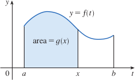
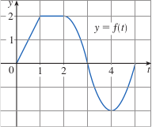
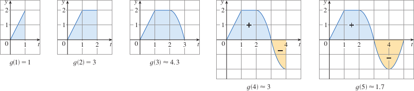

# 4.3: The Fundamental Theorem of Calculus

## The Fundamental Theorem of Calculus, Part 1
- The first part of the Fundamental Theorem deals with functions defined by equations like $$g(x) = \int_a^x f(t)\ dt$$ where $f$ is a continuous function on $[a, b]$ and $x$ varies between $a$ and $b$.
- $g$ depends only on $x$, which is the variable upper limit in the integral
- If $x$ is fixed, then $\int_a^x f(t)\ dt$ is a definite number, otherwise, if $x$ varies, then $\int_a^x f(t)\ dt$ also varies
- If $f$ is a positive function, then $g(x)$ can be interpreted as the area under the graph of $f$ from $a$ to $x$, where $x$ can vary from $a$ to $b$
- 
- If $g$ is defined as the integral of $f$, then $g$ turns out to be an antiderivative of $f$
> ### The Fundamental Theorem of Calculus, Part 1
> If $f$ is continuous on $[a, b]$, then the function $g$ defined by $$g(x) = \int_a^x f(t)\ dt;\ \ a \leq x \leq b$$ is continuous on $[a, b]$ and differentiable on $(a, b)$ and $g'(x) = f(x)$
- The abbreviated name of this theorem is FTC1 and it says that the derivative of a definite integral with respect to its upper limit is the integrand evaluated at the upper limit
- Using Leibniz notation for derivatives, FTC1 can be written as $$\frac{d}{dx}\int_a^x f(t)\ dt = f(x)$$ when $f$ is continuous
  - This function says that if we first integrate $f$ and then differentiate the result, we get back to the original function $f$
#### Examples
- Example 1: $g(x) = \int_0^xf(t)\ dt$, find the values of $g(0)$, $g(1)$, $g(2)$, $g(3)$, $g(4)$, and $g(5)$
  - 
  - First, notice that $g(0) = \int_0^0f(t)\ dt = 0$
  - $g(1)$ is the area of a triangle; $g(1) = \int_0^1f(t)\ dt = \frac{1}{2}(1 \cdot 2) = 1$
  - To find $g(2)$, add the area of a rectangle to $g(1)$
    - $g(2) = \int_0^2f(t)\ dt = \int_0^1f(t)\ dt + \int_1^2f(t)\ dt = 1 + (1 \cdot 2) = 3$
  - Estimate area under $f$ from 2 to 3 is about 1.3, so $g(3) = g(2) + \int_2^3f(t)\ dt \approx 3 + 1.3 = 4.3$
  - For $t \gt 3$, $f(t)$ is negative so we start subtracting areas
  - 

## The Fundamental Theorem of Calculus, Part 2
- The second part of the Fundamental Theorem of Calculus provides us with a simpler way to evaluate integrals
> ### The Fundamental Theorem of Calculus, Part 2
> - If $f$ is continuous on $[a, b]$, then $$\int_a^b f(x)\ dx = F(b) - F(a)$$ where $F$ is any antiderivative of $f$, that is, a function $F$ such that $F' = f$
- This can be abbreviated as FTC2
- This part two of the fundamental theorem states that if we know an antiderivative $F$ of $f$, then we can evaluate $\int_a^b f(x)\ dx$ by subtracting the values of $F$ at the endpoints of the interval $[a, b]$
- The FTC2 states that we can use *any* antiderivative $F$ of $f$, so we should use the simplest one
> ### Notation
> - We often use the notation $$F(x)]_a^b = F(b) - F(a)$$ so the equation of FTC2 can be written as $$\int_a^b f(x)\ dx = F(x)]_a^b\text{ where } F' = f$$
> - Other common notations are $F(x)|_a^b$ and $[F(x)]_a^b$
- Remember that the Fundamental Theorem of Calculus only applies to continuous functions

## Differentiation and Integration as Inverse Processes
> ### The Fundamental Theorem of Calculus
> - Suppose $f$ is continuous on $[a, b]$
> 1. If $g(x) = \int_a^x f(t)\ dt$, then $g'(x) = f(x)$
> 2. $\int_a^b f(x)\ dx = F(b) - F(a)$, where $F$ is any antiderivative of $f$, that is, $F' = f$
- Part one of the theorem can be rewritten as $\frac{d}{dx}\int_a^x f(t)\ dt = f(x)$
- Part two of the theorem says that we can write $\int_a^x F'(t)\ dt = F(x) - F(a)$, which says that if we differentiate a function $F$ and then integrate the result, we arrive back at the function $F$ (except for the constant $F(a)$)
- The two parts of the fundamental theorem of calculus say that integration and differentiation are inverse processes