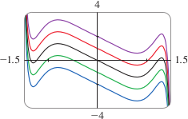
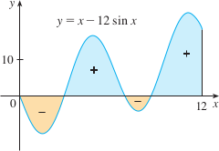
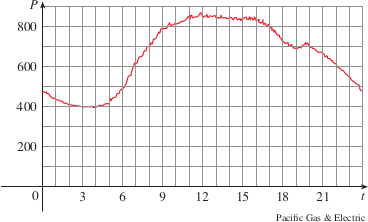

# 4.4: Indefinite Integrals and the Net Change Theorem

## Indefinite Integrals
- Both parts of the Fundamental Theorem of Calculus establish connections between an antiderivative and definite integrals
  1. If $f$ is continuous, then $\int_a^x f(t)\ dt$ is an antiderivative of $f$
  2. $\int_a^b f(x)\ dx$ can be found by evaluating $F(b) - F(a)$, where $F$ is an antiderivative of $f$
- The notation $\int f(x)\ dx$ is traditionally used for an antiderivative of $f$ and is called an **indefinite integral**
- Therefore, $\int f(x)\ dx = F(x)$ means $F'(x) = f(x)$
- So we can write $\int x^2dx = \frac{x^3}{3} + C$ because $\frac{d}{dx}(\frac{x^3}{3} + C) = x^2$
- This means that an indefinite integral represents an entire family of functions (one antiderivative for each value of the constant $C$)
> ### WARNING
> - Carefully distinguish between definite and indefinite integrals
> - A definite integral $\int_a^b f(x)\ dx$ is a number
> - An indefinite integral $\int f(x)\ dx$ is a function (or family of functions)

> ### Table of Indefinite Integrals
> - $\int cf(x)\ dx = c\int f(x)\ dx$
> - $\int [f(x) + g(x)]\ dx = \int f(x)\ dx + \int g(x)\ dx$
> - $\int k\ dx = kx + C$
> - $\int x^ndx = \frac{x^{n+1}}{n+1} + C \ (n \ne -1)$
> - $\int \sin x\ dx = -\cos x + C$
> - $\int \sec^2x\ dx = \tan x + C$
> - $\int \csc^2 dx = -\cot x + C$
> - $\int \sec x \tan x\ dx = \sec x + C$
> - $\int \csc x \cot x\ dx = -\csc x + C$

- The most general antiderivative on a given interval is obtained by adding a constant to a particular antiderivative
- When a formula for a general indefinite integral is given, it is valid only on an interval

#### Examples
- Example 1: Find the general indefinite integral $\int (10x^4 - 2\sec^2x)\ dx$
  - Split into multiple integrals and move constants outside of integral
    - $= 10\int x^4dx - 2\int \sec^2x\ dx$
  - Find antiderivatives of each integral
    - $= 10\frac{x^5}{5} - 2 \tan x + C$
    - $= 2x^5 - 2\tan x + C$
  - Answers can be checked by differentiating
  - Below are graphs of indefinite integral with different values of $C$
    - 
- Example 2: Evaluate $\int \frac{\cos \theta}{\sin^2 \theta}d\theta$
  - Use trig identities to rewrite the function before integrating
  - $\int \frac{\cos \theta}{\sin^2 \theta}d\theta = \int (\frac{1}{\sin\theta})(\frac{\cos\theta}{\sin\theta})d\theta$
  - $= \int \csc\theta\cot\theta\ d\theta = -\csc\theta + C$
- Example 3: Evaluate $\int_0^3(x^3 - 6x)\ dx$
  - This is a definite integral, use the Fundamental Theorem of Calculus part 2
  - Find antiderivatives for part of the integral
    - $\int_0^3(x^3 - 6x)\ dx = \frac{x^4}{4} - 6\frac{x^2}{x}]_0^3$
  - Evaluate using $F(b) - F(a)$
    - $ = (\frac{1}{4}\cdot 3^4 - 3 \cdot c^2) - (\frac{1}{4}\cdot 0^4 - 3\cdot0^2)$
    - $ = \frac{81}{4} - 27 - 0 + 0 = -6.75$
- Example 4: Evaluate $\int_0^{12}(x - 12\sin x)dx$
  - Definite integral, use the Fundamental Theorem and find antiderivatives
    - $\int_0^{12}(x - 12\sin x)dx = \frac{x^2}{2} - 12(-\cos x)]_0^{12}$
  - Evaluate using $F(b) - F(a)$
    - $ = \frac{1}{2}(12)^2 + 12(\cos12 - \cos0)$
    - $ = 72 + 12\cos12 - 12 = 60 + 12\cos12$
  - 
- Example 5: Evaluate $\int_1^9\frac{2t^2 + t^2\sqrt{t} - 1}{t^2}dt$
  - First write integrand in simpler form by carrying out division
    - $\int_1^9\frac{2t^2 + t^2\sqrt{t} - 1}{t^2}dt = \int_1^9(2 + t^{1/2} - t^{-2}) dt$
    - $ = 2t + \frac{t^{3/2}}{\frac{3}{2}} - \frac{t^{-1}}{-1}]_1^9 = 2t + \frac{2}{3}t^{3/2} + \frac{1}{t}]_1^9$
  - Evaluate using $F(b) - F(a)$
    - $ = (2 \cdot 9 + \frac{2}{3}\cdot 9^{3/2} + \frac{1}{9}) - (2 \cdot 1 + \frac{2}{3} \cdot 1^{3/2} + \frac{1}{1})$
    - $ = 18 + 18 + \frac{1}{9} - 2 - \frac{2}{3} - 1 = 32\frac{4}{9}$

## The Net Change Theorem
- Part 2 of FTC says that if $f$ is continuous on $[a, b]$, then $\int_a^b f(x)\ dx = F(b) - F(a)$, where $F$ is any antiderivative of $f$.
- This means that $F' = f$, so the equation can be rewritten as $\int_a^b F'(x)\ dx = F(b) - F(a)$
- $F'(x)$ represents the rate of change $y = F(x)$ with respect to $x$, and $F(b) - F(a)$ is the change in $y$ when $x$ changes from $a$ to $b$
  - Although $y$ may change in both directions, $F(b) - F(a)$ represents the *net change* in $y$
> ### Net Change Theorem
> The integral of a rate of change is the net change: $$\int_a^b F'(x)\ dx = F(b) - F(a)$$
- The principle in the Net Change Theorem applies to all rates of change in the natural and social sciences
- Example applications
  - If $V(t)$ is the volume of water in a reservoir at time $t$, then its derivative $V'(t)$ is the rate at which water flows into the reservoir at time $t$. So $$\int_{t_1}^{t_2} V'(t)\ dt = V(t_2) - V(t_1)$$ is the change in the amount of water in the reservoir between time $t_1$ and time $t_2$
  - If $[C](t)$ is the concentration of the product of a chemical reaction at time $t$, then the rate of reaction is the derivative $d[C]/dt$. So $$\int_{t_1}^{t_2} \frac{d[C]}{dt}dt = [C](t_2) - [C](t_1)$$ is the change in the concentration of $C$ from time $t_1$ to time $t_2$
  - If the mass of a rod is measured from the left end to a point $x$ is $m(x)$, then the linear density is $p(x) = m'(x)$. So $$\int_a^b p(x)\ dx = m(b) - m(a)$$ is the mass of the segment of the rod that lies between $x = a$ and $x = b$
  - If the rate of growth of a population is $dn/dt$, then $$\int_{t_1}^{t_2}\frac{dn}{dt}dt = n(t_2) - n(t_1)$$ is the net change in population during the time period from $t_1$ to $t_2$
  - If $C(x)$ is the cost of producing $x$ units of a commodity, then the marginal cost is the derivative $C'(x)$. So $$\int_{x_1}^{x_2} C'(x)dx = C(x_2) - C(x_1)$$ is the increase in cost when production is increased from $x_1$ units to $x_2$ units
  - If an object moves along a straight line with position function $s(t)$, then its velocity is $v(t) = s'(t)$, so $$\int_{t_1}^{t_2}v(t)\ dt = s(t_2) - s(t_1)$$ is the net change of position, or *displacement*, of the object during the time period from $t_1$ to $t_2$
  - The acceleration of an object is $a(t) = v'(t)$, so $$\int_{t_1}^{t_2}a(t)\ dt = v(t_2) - v(t_1)$$ is the change in velocity from time $t_1$ to $t_2$
#### Examples
- Example 6: Particle moves along a line so that its velocity at time $t$ is $v(t) = t^2 - t - 6$ (meters/second)
  - a. Find the displacement during the time period $1 \leq t \leq 4$
  - b. Find the distance traveled during this time period
  - a. The displacement is $s(4) - s(1) = \int_1^4 v(t)\ dt = \int_1^4(t^2 - t - 6)\ dt$
    - $ = [\frac{t^3}{3} - \frac{t^2}{2} - 6t]_1^4 = -\frac{9}{2}$
  - b. $v(t) = t^2 - t - 6 = (t - 3)(t + 2)$, so $v(t) \leq 0$ on the interval $[1, 3]$ and $v(t) \geq 0$ on $[3, 4]$
    - The distance traveled is
    - $ = \int_1^4|v(t)|\ dt = \int_1^3[-v(t)]\ dt + \int_3^4v(t)\ dt$
    - $ = [-\frac{t^3}{3} + \frac{t^2}{2} + 6t]_1^3 + [\frac{t^3}{3} - \frac{t^2}{2} - 6t]_3^4$
    - $ = \frac{61}{6} \approx 10.17m$
- Example 7: Estimate energy usage for a day from the graph, $P$ is power, $t$ is hours
  - 
  - Power is the rate of change of energy: $P(t) = E'(t)$, so, by the Net Change Theorem
    - $\int_0^{24}P(t)\ dt = \int_0^{24}E'(t)\ dt = E(24) - E(0)$
  - Approximate the value of the integral using the Midpoint Rule with 12 subintervals and $\Delta t = 2$
    - $\int_0^{24}P(t)\ dt \approx [P(1) + P(3) + \cdots + P(21) + P(23)]\Delta t$
    - $\approx (440 + 400 + 420 + 620 + 790 + 840 + 850 + 840 + 810 + 690 + 670 + 550)(2)$
    - $ = 15,840$