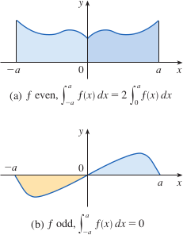

# 4.5: The Substitution Rule
- Because of the Fundamental Theorem, it's important to be able to find antiderivatives. But our antidifferentiation formulas don't tell us how to evaluate integrals such as $\int2x\sqrt{1+x^2}dx$
- To find this integral, we need to introduce something extra, which is a new variable, changing the variable $x$ to a new variable $u$

## Substitution: Indefinite Integrals
- Let $u$ be the quantity under the root sign, $1 + x^2$. Then the differential of $u$ is $du = 2x\ dx$
- If $dx$ in the notation for an integral were to be interpreted as a differential, then the differential $2x\ dx$ would occur in $\int 2x\sqrt{1 + x^2}dx$
  - So, we can write $\int2x\sqrt{1+x^2}dx = \int \sqrt{1 + x^2}2x\ dx = \int\sqrt{u}\ du$
    - $ = \frac{2}{3}u^{3/2} + C = \frac{2}{3}(1 + x^2)^{3/2} + C$
  - If $u = f(x)$ then $du = f'(x)dx$
- We can check we have the correct answer by using the chain rule
  - $\frac{d}{dx}[\frac{2}{3}(1 + x^2)^{3/2} + C] = \frac{2}{3} \cdot \frac{3}{2}(1 + x^2)^{1/2} \cdot 2x = 2x\sqrt{1 + x^2}$
- This method generally works when we have an integral that we can write in the form $\int f(g(x))g'(x)\ dx$
  - If $F' = f$, then $\int F'(g(x))g'(x)\ dx = F(g(x)) + C$
  - This works, because by the chain rule, $\frac{d}{dx}[F(g(x))] = F'(g(x))g'(x)$
- If we make the "change of variable" or "substitution" of $u = g(x)$ then we have
  - $\int F'(g(x))g'(x)\ dx = F(g(x)) + C = F(u) + C = \int F'(u)\ du$
- Or, writing $F' = f$, we get
  - $\int f(g(x))g'(x)\ dx = \int f(u)\ du$
> ### The Substitution Rule
> If $u = g(x)$ is a differentiable function whose range is an interval $I$ and $f$ is continuous on $I$, then $$\int f(g(x))g'(x)\ dx = \int f(u)\ du$$
- The Substitution Rule says: **it is permissible to operate with *dx* and *du* after integral signs as if they were differentials**
- The idea behind the substitution rule is to replace a complicated integral with a simpler integral, by changing the original variable $x$ to a new variable $u$ that is a function of $x$
- The main challenge in using the substitution rule is to think of an appropriate substitution
- Try to choose $u$ to be some function in the integrand whose differential also occurs (except for a constant factor)
  - If this is not possible, try choosing $u$ to be some complicated part of the integrand

#### Examples
- Example 1: Find $\int x^3\cos(x^4 + 2)\ dx$
  - Make the substitution $u = x^4 + 2$ because its differential $du = 4x^3dx$ occurs in the integral (apart from the constant factor)
  - Using $x^3dx = \frac{1}{4}du$ and the Substitution Rule, we have
    - $\int x^3\cos(x^4 + 2)\ dx = \int\cos u \cdot \frac{1}{4}du = \frac{1}{4}\int\cos u\ du$
    - $ = \frac{1}{4}\sin u + C$
    - $ = \frac{1}{4}\sin(x^4+2) + C$
  - Note that at the final stage, we return to the original variable $x$
- Example 2: Evaluate $\int\sqrt{2x + 1}dx$
  - Make the substitution $u = 2x + 1$, then $du = 2\ dx$, so $dx = \frac{1}{2}\ du$
  - The substitution rule gives $\int\sqrt{2x + 1}dx = \int\sqrt{u}\cdot \frac{1}{2} du = \frac{1}{2}\int u^{1/2}du$
  - $ = \frac{1}{2} \cdot \frac{u^{3/2}}{3/2} + C = \frac{1}{3}(2x + 1)^{3/2} + C$
- Example 3: Find $\int \frac{x}{\sqrt{1 - 4x^2}}dx$
  - Let $u = 1 - 4x^2$, then $du = -8x\ dx$, so $x\ dx = -\frac{1}{8}du$
    - $\int \frac{x}{\sqrt{1 - 4x^2}}dx = -\frac{1}{8}\int\frac{1}{\sqrt{u}}du = -\frac{1}{8}\int u^{-1/2}du$
    - $ = -\frac{1}{8}(2\sqrt{u}) + C = -\frac{1}{4}\sqrt{1 - 4x^2} + C$
- Example 4: Evaluate $\int\cos5x\ dx$
  - Let $u = 5x$, then $du = 5dx$, so $dx = \frac{1}{5}du$
  - Therefore, $\int\cos5x\ dx = \frac{1}{5}\int\cos u\ du = \frac{1}{5}\sin{u} + C = \frac{1}{5}\sin5x + C$

## Substitution: Definite Integrals
- When evaluating a definite integral by substitution, two methods are possible
  - One is to evaluate the indefinite integral first, then use the Fundamental Theorem
    - For example, $\int_0^4\sqrt{2x + 1}dx = \int\sqrt{2x+1}dx]_0^4$
      - $\frac{1}{3}(2x) + 1)^{3/2}]_0^4 = \frac{1}{3}(9)^{3/2} - \frac{1}{3}(1)^{3/2}$
      - $\frac{1}{3}(27-1) = \frac{26}{3}$
  - Another method, which is usually preferred, is to change the limits of integration when the variable is changed
> ### Substitution Rule for Definite Integrals
> If $g'$ is continuous on $[a, b]$ and $f$ is continuous on the range of $u = g(x)$, then $$\int_a^b f(g(x))g'(x)\ dx = \int_{g(a)}^{g(b)}f(u)du$$
- This rule says that when using a substitution in a definite integral, we must put everything in terms of the new variable $u$, not only $x$ and $dx$, but also the limits of the integration
- The new limits of integration are the values of $u$ that correspond to $x = a$ and $x = b$
- When using this substitution rule for definite integrals, you do not return to the variable $x$ after integrating, but rather you evaluate the expression in $u$ between the appropriate values of $u$

#### Examples
- Example 6: Evaluate $\int_0^4 \sqrt{2x + 1}dx$
  - Using substitution rule, we have $u = 2x + 1$ and $dx = \frac{1}{2}du$
  - To find new limits of integration, we note that when $x = 0$, $u = 2(0) + 1 = 1$ and when $x = 4$, $u = 2(4) + 1 = 9$
  - Therefore, $\int_0^4 \sqrt{2x + 1}dx = \int_1^9\frac{1}{2}\sqrt{u}\ du$
    - $ = \frac{1}{2} \cdot \frac{2}{3}u^{3/2}]_1^9$
    - $ = \frac{1}{3}(9^{3/2} - 1^{3/2}) = \frac{26}{3}$
- Example 7: Evaluate $\int_1^2 \frac{dx}{(3-5x)^2}$
  - Let $u = 3 - 5x$, so $du = -5dx$, so $dx = -\frac{1}{5}du$
    - When $x = 1$, $u = -2$, and when $x = 2$, $u = -7$
  - Therefore, $\int_1^2 \frac{dx}{(3-5x)^2} = -\frac{1}{5}\int_{-2}^{-7}\frac{du}{u^2} = -\frac{1}{5}[-\frac{1}{u}]_{-2}^{-7} = \frac{1}{5u}]_{-2}^{-7}$
    - $ = \frac{1}{5}(-\frac{1}{7} + \frac{1}{2}) = \frac{1}{14}$

## Symmetry
- You can use the Substitution Rule for Definite Integrals to simplify the calculation of integrals of functions that possess symmetry properties
> ### Integrals of Symmetric Functions
> Suppose $f$ is continuous on $[-a, a]$
> a. If $f$ is even, then $\int_{-a}^{a}f(x)\ dx = 2\int_0^{a}f(x)\ dx$
> b. If $f$ is odd, then $\int_{-a}^{a}f(x)\ dx = 0
- Function $f$ is even if $f(-x) = f(x)$ for all $x$
- Function $f$ is odd if $f(-x) = -f(x)$ for all $x$
- 

#### Examples
- Example 8: Because $f(x) = x^6 + 1$ satisfies $f(-x) = f(x)$, it is even
  - $\int_{-2}^2 (x^6 + 1)\ dx = 2\int_0^2(x^6 + 1)\ dx$
  - $ = 2[\frac{1}{7}x^7 + x]_0^2 = 2(\frac{128}{7} + 2) = \frac{284}{2}$
- Example 9: Because $f(x) = (\tan x)/(1 + x^2 + x^4)$ satisfies $f(-x) = -f(x)$, it is odd
  - $\int_{-1}^{1} \frac{\tan x}{1 + x^2 + x^4}\ dx = 0$