# 5.1: Areas between Curves
## Areas between Curves: Integrating with Respect to $x$
- Similar to what we have done for finding area under curves (in 4.1), we can divide the area into $n$ strips of equal width and then approximate the $i$th strip as a rectangle with a base of $\Delta x$ and a height of $f(x^*_i) - g(x^*_i)$
- 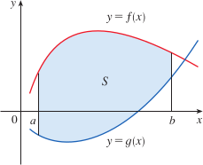
- Similar to before, we can use the Riemann sum to approximate the area of $S$
- 
- These approximations become better as $n \to \infty$
- The area $A$ of the region bounded by curves $y = f(x)$, $y = g(x)$, and the lines $x = a$, $x = b$, where $f$ and $g$ are continuous and $f(x) \geq g(x)$ for all $x$ in $[a, b]$, is $$A = \int_a^b[f(x) - g(x)]\ dx$$
- 

#### Examples
- Example 1: Find the area of the region bounded above by $y = x^2 + 1$, bounded below by $y = x$, and bounded on the sides by $x = 0$ and $x = 1$
  - The figure below shows the region, so we use the area formula (above) with $f(x) = x^2 + 1$, $g(x) = x$, $a = 0$, and $b = 1$
  - $$A = \int_0^1[(x^2 + 1) - x]dx = \int_0^1(x^2 - x + 1)dx$$
  - $$= \frac{x^3}{3} - \frac{x^2}{2} + x]^1_0 = \frac{1}{3} - \frac{1}{2} + 1 = \frac{5}{6}$$
  - 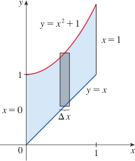
- Example 2: Find the area of the region enclosed by the parabolas $y = x^2$ and $y = 2x - x^2$
  - First find the points of intersection, by solving the parabolas simultaneously
  - $x^2 = 2x - x^2$ becomes $2x^2 - 2x = 0$, then $2x(x - 1) = 0$, so $x = 0$ or $x = 1$
    - So, the points of intersection are $(0, 0)$ and $(1, 1)$
  - The top and bottom boundaries are $y_T = 2x - x^2$ and $y_B = x^2$
  - The area of a typical rectangle is $(y_T - y_B)\Delta x = (2x - x^2 - x^2)\Delta x = (2x - 2x^2)\Delta x$
  - The region to find lies between $x = 0$ and $x = 1$
  - Therefore, the total area is $$a = \int_0^1(2x - 2x^2)\ dx = 2\int_0^1(x - x^2)\ dx$$
  - $$ = 2[\frac{x^2}{2} - \frac{x^3}{3}]_0^1 = 2(\frac{1}{2} - \frac{1}{3}) = \frac{1}{3}$$
  - 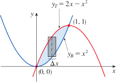
- Example 3: Find the approximate area of the region bounded by the curves $y = \frac{x}{\sqrt{x^2 + 1}}$ and $y = x^4 - x$
  - In this instance, it is impossible to solve the equation $\frac{x}{\sqrt{x^2 + 1}} = x^4 - x$, but using a computer, we can find that one intersection point is the origin, another is $x \approx 1.18$
  - So approximation of area between the curves is $$A \approx \int_0^{1.18}[\frac{x}{\sqrt{x^2 + 1}} - (x^4 - x)]\ dx$$
  - To integrate first term, we can use substitution $u = x^2 + 1$
  - Then we have $du = 2x dx$, and when $x = 1.18$, we have $u \approx 2.39$, when $x = 0$, $u = 1$
  - $$A \approx \frac{1}{2}\int_1^{2.39}\frac{du}{\sqrt{u}} - \int_0^{1.18}(x^4 - x)\ dx$$
  - $$= \sqrt{u}]^{2.39}_1 - [\frac{x^5}{5} - \frac{x^2}{2}]_0^{1.18}$$
  - $$= \sqrt{2.39} - 1 - \frac{1.18)^5}{5} + \frac{(1.18)^2}{2}$$
  - $$\approx 0.785$$
  - 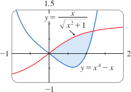

- When setting up an integral for an area, it can be helpful to sketch the region to identify the top curve/bottom curve, and approximating rectangle
- Sometimes it is not very straightforward to find the points of intersection between two curves exactly
- We can also sometimes be asked to find areas between curves in multiple regions
- 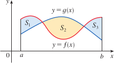
- The area between curves $y = f(x)$ and $y = g(x)$ and between $x = a$ and $x = b$ is $$A = \int_a^b|f(x) - g(x)|\ dx$$
- If you are evaluating areas between curves in multiple locations, you have to split the integrals into corresponding areas, $A_1$, $A_2$, etc, ...

#### Examples
- Example 4: Find the area of the region bounded by the curves $y = \sin x$, $y = \cos x$, $x = 0$, and $x = \frac{\pi}{2}$
  - The points of intersection occur where $\sin x = \cos x$, which is where $x = \frac{\pi}{4}$
  - 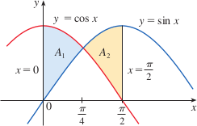
  - Because $\cos x \geq \sin x$ when $0 \leq x \leq \pi/4$ but $\sin x \geq \cos x$ when $\pi/4 \leq x \leq \pi/2$, the required area is
  - $$A = \int_0^{\pi/2}|\cos x - \sin x|\ dx = A_1 + A_2$$
  - $$= \int_0^{\pi/4}(\cos x - \sin x)\ dx + \int_{\pi/4}^{\pi/2}(\sin x - \cos x)\ dx$$
  - $$= [\sin x + \cos x]_0^{\pi/4} + [-\cos x - \sin x]_{\pi/4}^{\pi/2}$$
  - $$= (\frac{1}{\sqrt{2}} + \frac{1}{\sqrt{2}} - 0 - 1) + (-0 - 1 + \frac{1}{\sqrt{2}} + \frac{1}{\sqrt{2}})$$
  - $$= 2\sqrt{2} - 2$$
  - For this particular example, because the region is symmetric about $x = \pi/4$, we could have done $$A = 2A_1 = 2\int_0^{\pi/4}(\cos x - \sin x)\ dx$$

## Area between Curves: Integrating with Respect to $y$
- Some regions are best treated by regarding $x$ as a function of $y$
- If a region is bounded by $x = f(y)$, $x = g(y)$, $y = c$, and $y = d$, then its area is $$A = \int_c^d[f(y) - g(y)]\ dy$$
- 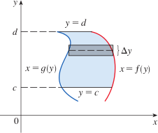
- Writing $x_R$ for the right boundary and $x_L$ for the left boundary, we have $$A = \int_c^d(x_R - x_L)\ dy$$
- 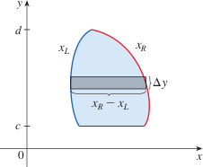

#### Examples
- Example 5: Find the area enclosed by the line $y = x - 1$ and the parabola $y^2 = 2x + 6$
  - Solving the two equations simultaneously gives us the points of intersection $(-1, -2)$ and $(5, 4)$
  - Solving the equation of the parabola for $x$, we see the left and right boundary curves are $x_L = \frac{1}{2}y^2 - 3$ and $x_R = y + 1$
  - We have to integrate between the appropriate y-values, $y = -2$ and $y = 4$
  - $$A = \int_{-2}^4(x_R - x_L)\ dy = \int_{-2}^4[(y + 1) - (\frac{1}{2}y^2 - 3)]\ dy$$
  - $$ = \int_{-2}^4(-\frac{1}{2}y^2 + y + 4)\ dy$$
  - $$ = -\frac{1}{2}(\frac{y^3}{3}) + \frac{y^2}{2} + 4y]_{-2}^4$$
  - $$ = -\frac{1}{6}(64) + 8 + 16 - (\frac{4}{3} + 2 - 8) = 18$$
  - 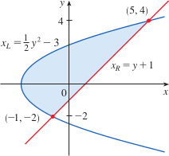
  - Note that this example could have been solved by integrating with respect to $x$, but the calculation is much harder
- Example 6: Find the area of the region enclosed by the curves $x + 2y = 3$, $y = x$, and $y = \frac{1}{4}x$ using $x$ as the variable of integration and $y$ as the variable of integration
  - 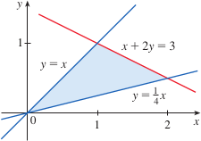
  - If we integrate with respect to $x$, we have to split the region into two parts, because the top boundary consists of two separate curves
    - The area is computed as $$A = A_1 + A_2 = \int_0^1(x - \frac{1}{4}x)dx + \int_1^2(-\frac{1}{2}x + \frac{3}{2} - \frac{1}{4}x)\ dx$$
    - $$= [\frac{3}{8}x^2]_0^1 + [-\frac{3}{8}x^2 + \frac{3}{2}x]_1^2 = \frac{3}{4}$$
  - If we integrate with respect to $y$, we also need to divide the region into two parts because the right boundary consists of two separate curves
    - The area is $$A = A_1 + A_2 = \int_0^{1/2}(4y - y)dy + \int_{1/2}^1(3 - 2y - y)dy$$
    - $$= [\frac{3}{2}y^2]_0^{1/2} + [3y - \frac{3}{2}y^2]_{1/2}^1 = \frac{3}{4}$$
  - 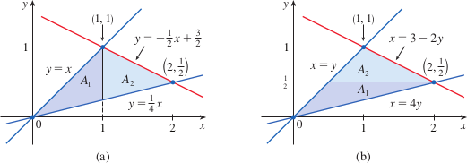
