# 5.2: Volumes

## Definition of Volume
- To start, we take a simple type of solid called as **cylinder** (or a *right cylinder*)
- The cylinder is bounded by the plane region $B_1$, which is called the **base**, and a congruent region $B_2$, in a parallel plane
- The cylinder consists of all points on line segments that are perpendicular to the base and join $B_1$ to $B_2$
- If the area of the base is $A$ and the height of the cylinder is $h$, then the volume $V$ of the cylinder is defined as $V = Ah$
- If the base is a circle with radius $r$, then the cylinder is a circular cylinder with volume $V = \pi r^2h$
- If the base is rectangle with length $l$ and width $w$, then the cylinder is a rectangular box with volume $V = lwh$
- 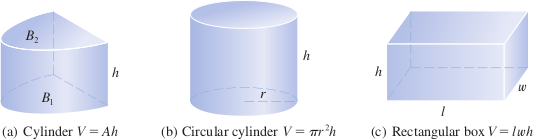
- For a solid $S$ that isn't a cylinder, we cut $S$ into pieces and approximate each piece by a cylinder, then add them all together to estimate the volume of $S$
- 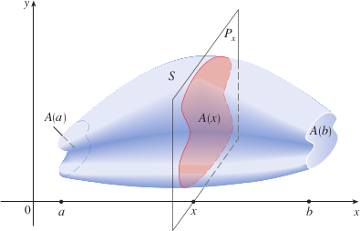
- Divide $S$ into $n$ "slabs" of width $\Delta x$
- 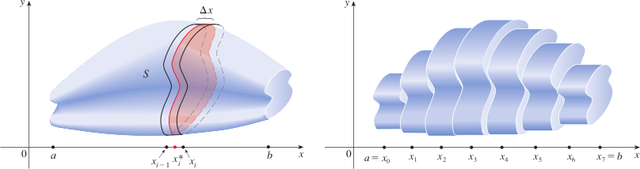
- Volume of the cylinder is $A(x_i^*)\Delta x$, so the approximate volume of the $i$th slab $S_i$ is $V(S_i) \approx A(x^*_i)\Delta x$
- Adding the volumes of these slabs together, we can approximate total volume of the cylinder $$V \approx \sum_{i = 1}^n A(x_i^*) \Delta x$$
- This is similar to the Riemann sum and the limit of these is a definite integral, so we can create a definition of volume

> ### Definition of Volume
> Let $S$ be a solid that lies between $x = a$ and $x = b$. If the cross-sectional area of $S$ in the plane $P_x$, through $x$ and perpendicular to the x-axis, is $A(x)$, where $A$ is a continuous function, then the **volume** of $S$ is $$V = \lim_{n \to \infty} \sum_{i = 1}^{n} A(x_i^*) \Delta x = \int_a^b A(x)\ dx$$

- When we use this volume formula, it is important to remember that the slices are obtained by slicing through $x$ perpendicular to the x-axis
- For a cylinder, the cross-sectional area is constant, so $A(x) = A$ for all $x$

#### Examples
- Example 1: Show that the volume of a sphere of radius $r$ is $V = \frac{4}{3}\pi r^3$
  - If we place the sphere so that its center is at the origin, then the plane $P_x$ intersects the sphere in a circle whose radius is $y = \sqrt{r^2 - x^2}$. So the cross-sectional area is $A(x) = \pi y^2 = \pi(r^2 - x^2)$
  - 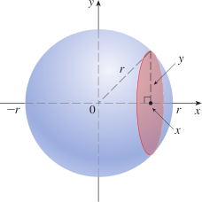
  - Using the definition of volume with $a = -r$ and $b = r$, we have
  - $$V = \int_{-r}^r A(x)\ dx = \int_{-r}^r \pi(r^2 - x^2)\ dx$$
  - $$ = 2\pi \int_0^r (r^2 - x^2)\ dx$$ (the integrand is even)
  - $$ = 2\pi [r^2x - \frac{x^3}{3}]_0^r = 2\pi(r^3 - \frac{r^3}{3}) = \frac{4}{3}\pi r^3$$
  - Here the slabs are circular cylinders, or *disks*. The figure below shows an example of using greater and great numbers of disks to approximate the volume
  - 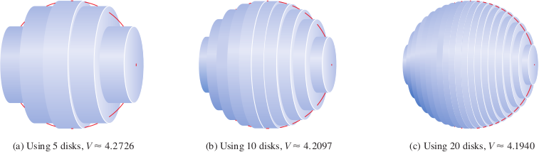

## Volumes of Solids of Revolution
- If we revolve a region about a line, we obtain a **solid of revolution**
- For such a solid, cross-sections perpendicular to the axis of rotation are circular

#### Examples
- Example 2: Find the volume of a solid obtained by rotating about the x-axis the region under the curve $y = \sqrt{x}$ from 0 to 1
  - 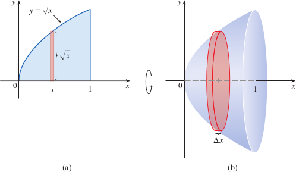
  - The original region defined by the curve $y = \sqrt{x}$ is shown in (a) above, with the rotation giving us the solid shown in (b)
  - If we slice through point $x$, we get a disk with radius $\sqrt{x}$
  - The area of this cross-section is $A(x) = \pi(\sqrt{x})^2 = \pi x$ and the volume of the approximating cylinder (a disk with thickness $\Delta x$) is $A(x)\ \Delta x = \pi x \Delta x$
  - The solid lies between $x = 0$ and $x = 1$, so its volume is $$V = \int_0^1 A(x)\ dx = \int_0^1 \pi x\ dx = \pi\frac{x^2}{2}]_0^1 = \frac{\pi}{2}$$
- Example 3: Find the volume of the solid obtained by rotating the region bounded by $y = x^3$, $y = 8$, and $x = 0$ about the y-axis
  - 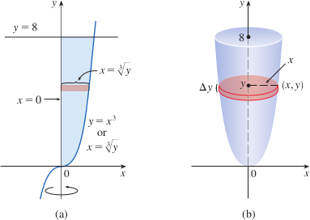
  - The region bounded by the curve $y = x^3$ is shown in (a) and the rotation giving us the solid is shown in (b)
  - Because the region is rotated about the y-axis, it makes sense to slice the solid perpendicular to the y-axis (obtaining cross-sections) and then integrating with respect to y.
  - If we slice at height $y$, we get a circular disk with radius $x$, where $x = \sqrt[3]{y}$
  - The area of the cross-section through $y$ is $A(y) = \pi(x)^2 = \pi(\sqrt[3]{y})^2 = \pi y^{2/3}$
  - The volume of the approximating cylinder is $A(y) \Delta y = \pi y^{2/3}\Delta y$
  - Since the solid is between $y = 0$ and $y = 8$, its volume is $$V = \int_0^8 A(y)\ dy = \int_0^8 \pi y^{2/3}dy = \pi[\frac{3}{5}y^{5/3}]_0^8 = \frac{96\pi}{5}$$

- Some solids of revolution will have a hollow core surrounding the axis of revolution
#### Examples
- Example 4: The region $\mathscr{R}$ enclosed by the curves $y = x$ and $y = x^2$ is rotated about the x-axis, find the volume of the resulting solid
  - The curves $y = x$ and $y = x^2$ intersect at the points $(0, 0)$ and $(1, 1)$
    - $x^2 = x \to x^2 - x = 0 \to x(x - 1) = 0 \to x = 0;x = 1$
  - 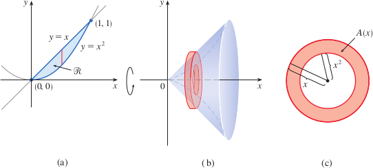
  - A cross-section in the plane $P_x$ has the shape of a *washer* with an inner radius of $x^2$ and outer radius of $x$, so we are finding the cross-sectional area by subtracting the area of the inner circle from the area of the outer circle
  - $A(x) = \pi(x)^2 - \pi(x^2)^2 = \pi(x^2 - x^4)$
  - This gives us $$V = \int_0^1 A(x)\ dx = \int_0^1 \pi(x^2 - x^4) dx$$
  - $$ = \pi[\frac{x^3}{3} - \frac{x^5}{5}]_0^1 = \frac{2\pi}{15}$$
- Example 5: Find the volume of the solid obtained by rotating the region in the previous example about the line $y = 2$
  - The solution and solid are shown in the figure below, it is still a washer, but the inner radius here is $2 - x$ and the outer radius is $2 - x^2$
  - The cross-sectional area now becomes $A(x) = \pi(2 - x^2)^2 - \pi(2 - x)^2$
  - Then the volume of $S$ is
    - $$V = \int_0^1 A(x)\ dx$$
    - $$ = \pi \int_0^1[(2 - x^2)^2 - (2 - x)^2]\ dx$$
    - $$ = \pi \int_0^1(x^4 - 5x^2 + 4x)\ dx$$
    - $$ = \pi [\frac{x^5}{5} - 5\frac{x^3}{3} + 4\frac{x^2}{2}]_0^1 = \frac{8\pi}{15}$$
---
- In general, the volume of a solid of revolution is calculated by using the basic defining formula $$V = \int_a^b A(x)\ dx$$ or $$V = \int_c^d A(y)\ dy$$
- The cross-sectional area $A(x)$ or $A(y)$ is found in one of the following ways
  - If the cross-section is a disk, we find the radius of the disk (in terms of x or y) and use $A = \pi(\text{radius})^2$
  - If the cross-section is a washer, we find the inner radius $r_{\text{in}}$ and the outer radius $r_{\text{out}}$ and compute the area of the washer by subtracting the area of the inner disk from the area of the outer disk $A = \pi(\text{outer radius})^2 - \pi(\text{inner radius})^2$
#### Examples
- Example 6: Find the volume of the solid obtained by rotating the region defined by $y = x$ and $y = x^2$ about the line $x = -1$
  - The figure is a washer with an inner radius of $1 + y$ and outer radius of $1 + \sqrt{y}$, so the cross section area is
    - $A(y) = \pi(\text{outer radius})^2 - \pi(\text{inner radius})^2$
    - $ = \pi(1 + \sqrt{y})^2 - \pi(1 + y)^2$
  - The volume is then $$V = \int_0^1 A(y)\ dy = \pi\int_0^1[(1 + \sqrt{y})^2 - (1 + y)^2]dy$$
  - $$ = \pi\int_0^1(2\sqrt{y} - y - y^2)dy = \pi[\frac{4y^{3/2}}{3} - \frac{y^2}{2} - \frac{y^3}{3}]_0^1 = \frac{\pi}{2}$$
  - 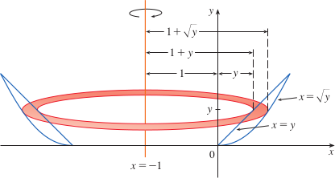

## Finding Volume Using Cross-Sectional Area
- In addition to volumes of solids of revolution, we can find volumes of solids whose cross-sections have areas that are readily computable
#### Examples
- Example 7: Find the volume of a solid with a circular base of radius 1 and parallel cross-sections perpendicular to the base are equilateral triangles
  - 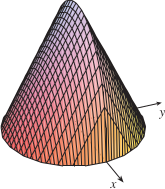
  - Assume the circle is $x^2 + y^2 = 1$
  - 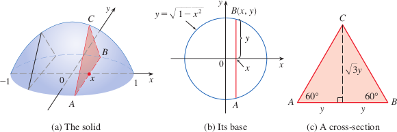
  - Since $B$ lies on the circle, we have $y = \sqrt{1 - x^2}$, so the base of the triangle $ABC$ is $|AB| = 2y = 2\sqrt{1 - x^2}$
  - Since the triangle is equilateral, its height is $\sqrt{3}y = \sqrt{3}\sqrt{1 - x^2}$
  - Cross-sectional area is $$A(x) = \frac{1}{2} \cdot 2\sqrt{1 - x^2} \cdot \sqrt{3}\sqrt{1 - x^2} = \sqrt{3}(1 - x^2)$$
  - The volume of the solid is $$V = \int_{-1}^1 A(x)\ dx = \int_{-1}^{1}\sqrt{3}(1 - x^2)\ dx$$
  - $$ = 2\int_0^1 \sqrt{3}(1 - x^2)\ dx = 2\sqrt{3}[x - \frac{x^3}{3}]_0^1 = \frac{4\sqrt{3}}{3}$$
- Example 8: Find the volume of a pyramid whose base is a square with side $L$ and whose height is $h$
  - Place the origin $O$ at the vertex of the pyramid and the x-axis along its central axis
    - 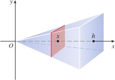
  - Any plane that passes through $x$ and is perpendicular to the x-axis intersects the pyramid in a square with side of length $s$
  - Using similar triangles, we can express $s$ in terms of $x$ $$\frac{x}{h} = \frac{s/2}{L/2} = \frac{s}{L}$
    - So $s = Lx/h$
  - So cross-sectional area is $A(x) = s^2 = \frac{L^2}{h^2}x^2$
  - Because the pyramid is between $x = 0$ and $x = h$, its volume is $$V = \int_0^h A(x)\ dx = \int_0^h \frac{L^2}{h^2}x^2dx$$
  - $$\frac{L^2}{h^2}\frac{x^3}{3}]_0^h = \frac{L^2h}{3}$$
- Example 9: A wedge is cut out of a circular cylinder of radius 4 by two planes. One plane is perpendicular to the axis of the cylinder. The other intersects the first at an angle of $30^\circ$ along a diameter of the cylinder. Find the volume of the wedge
  - 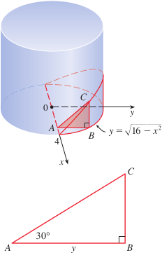
  - If you place the x-axis along the diameter where the planes meet, then the base of the solid is a semicircle with equation $y = \sqrt{16 - x^2}$, $-4 \leq x \leq 4$
  - A cross-section perpendicular to the x-axis at a distance $x$ from the origin is a triangle $ABC$, whose base is $y = \sqrt{16 - x^2}$ and whose height is $|BC| = y \tan 30 = \sqrt{16 - x^2}/\sqrt{3}$
  - The cross-sectional area is $A(x) = \frac{1}{2}\sqrt{16 - x^2} \cdot \frac{1}{\sqrt{3}}\sqrt{16 - x^2}$
  - $ = \frac{16 - x^2}{2\sqrt{3}}$
  - The volume of the wedge is $$V = \int_{-4}^4 A(x)\ dx = \int_{-4}^4 \frac{16 - x^2}{2\sqrt{3}}dx$$
  - $$\frac{1}{\sqrt{3}} \int_0^4(16 - x^2)\ dx = \frac{1}{\sqrt{3}[16x - \frac{x^3}{3}]_0^4 = \frac{128}{3\sqrt{3}}$